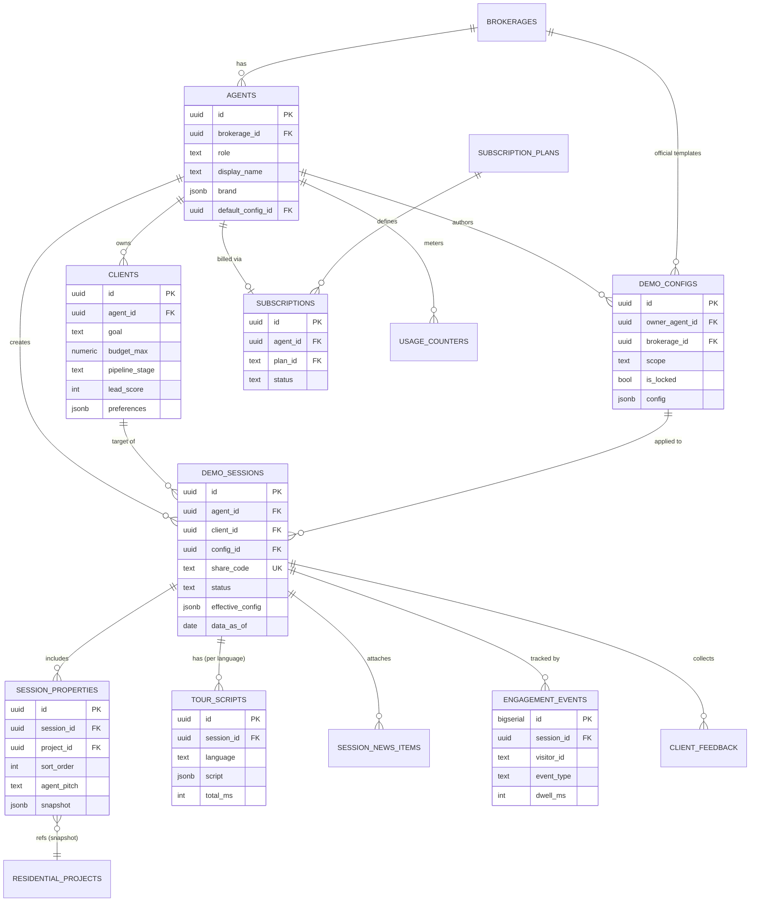
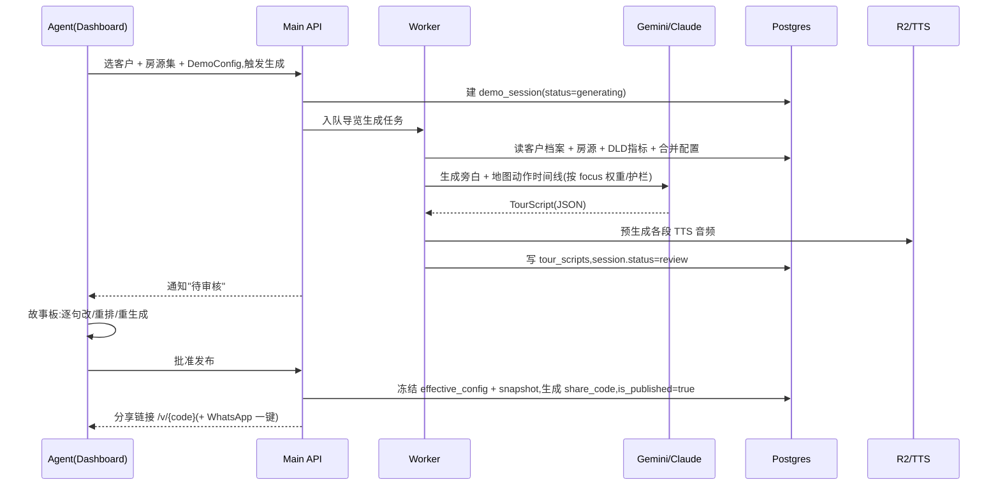
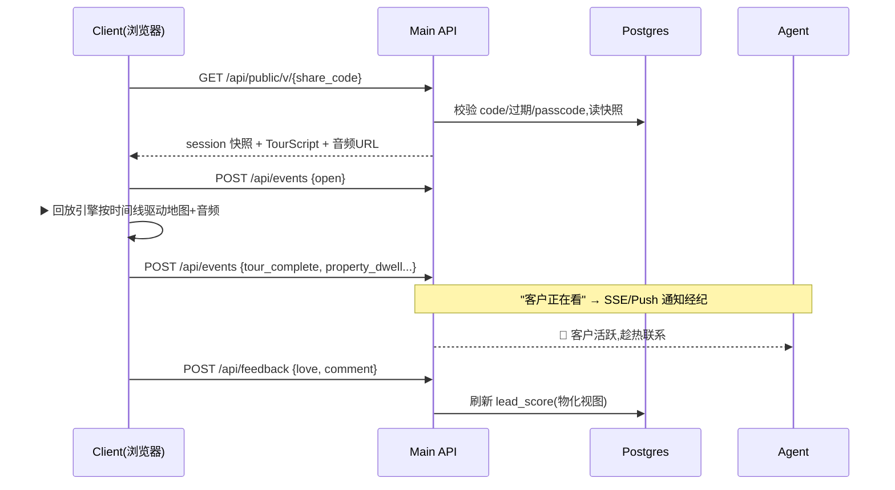
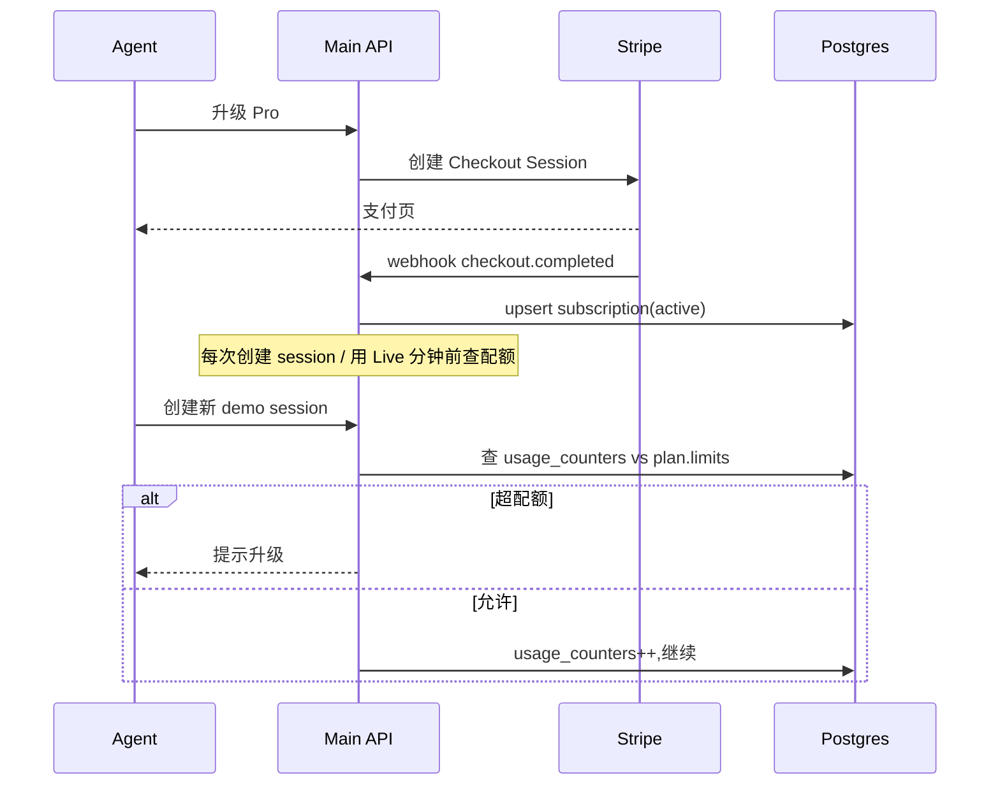

# Gulf Property — 经纪 Demo SaaS 设计规格(Design Spec)

> 版本:v1 · 2026-05-30
> 范围:把现有 B2C 房产平台改造为 B2B2C 经纪 SaaS——经纪可配置 AI(Luna)如何向客户 demo 房产,生成可分享的交互式导览,按订阅收费。
> 配套评估见:`docs/reports/2026-05-30-agent-saas-pivot-eval.md`

---

## 0. 角色(Personas)

| 角色 | 说明 | 关键诉求 |
|---|---|---|
| **Agent(经纪)** | 付费订阅用户。建客户档案、配置 demo、生成并分享导览 | 显得专业、省时间、加速成交、判断该追谁 |
| **Client(客户)** | 经纪的潜在买家。免登录,点链接看导览 | 看得懂、信得过、远程也能"逛" |
| **Brokerage Admin(经纪行管理)** | Team 档。管理多个经纪、统一品牌/合规模板 | 品牌一致、合规、团队业绩可见 |
| **Platform Admin** | 我方运营 | 数据管线、用量、计费 |

---

## 1. 领域模型(核心概念)

```
Brokerage(经纪行,可选)
  └── Agent(经纪)
        ├── Client(客户档案 / CRM)
        ├── DemoConfig(demo 配置模板 / Playbook)   ← "AI 怎么 demo" 的载体
        └── DemoSession(可分享的导览实例)            ← 产品的核心可分享对象
              ├── SessionProperty(本次选中的房源 + 排序 + 强调)
              ├── TourScript(预生成的旁白 + 地图动作时间线)
              ├── SessionNewsItem(经纪挑选的新闻/背景)
              ├── EngagementEvent(客户观看行为遥测)
              └── ClientFeedback(客户对房源的反馈)
Subscription / Plan / UsageCounter(计费与计量)
```

**DemoSession = 产品灵魂**:它是一个**不可变快照**——发布瞬间冻结所选房源、价格、数据、配置和已生成的导览脚本。客户看到的与经纪审核时一致,数据带"as of 日期"。

---

## 2. 配置 AI 如何 Demo(核心特性)

### 2.1 三层配置叠加

```
Agent 全局默认  ──覆盖──▶  DemoConfig 模板(Playbook)  ──覆盖──▶  Session 级覆盖
   (品牌/语气基线)            (豪宅投资客 / 刚需家庭 / 速览)        (针对此客户微调)
```

最终生效配置 = 三层深合并(deep-merge),存入 `demo_sessions.effective_config`(JSONB 快照),保证可复现。

### 2.2 可配置维度(`demo_configs.config` JSONB schema)

```jsonc
{
  "persona": {
    "voice": "Aoede",                  // Aoede|Puck|Charon|Kore|Fenrir
    "tone": "concierge",               // professional|warm|energetic|concierge
    "formality": 0.7,                  // 0..1
    "languages": ["zh", "en"]          // 生成的语言版本
  },
  "narrative_focus": {                 // 权重,和=1,驱动 Luna 重点
    "investment": 0.4,
    "lifestyle": 0.25,
    "family_schools": 0.15,
    "prestige": 0.1,
    "value": 0.1
  },
  "pacing": {
    "target_seconds": 150,             // 60 速览 / 150 标准 / 300 详解
    "speed": 1.0
  },
  "map_choreography": {
    "always_show_distance_to": ["metro", "beach", "airport"],
    "poi_categories": ["school", "hospital", "mall", "metro_station"],
    "heatmap_metric": "capitalGrowth", // capitalGrowth|rentalYield|null
    "use_amenity_spokes": true,
    "min_zoom": 13
  },
  "talking_points": [                  // 经纪手写,注入旁白
    "强调这是开发商最后一期",
    "提到 5 分钟到 GEMS 学校"
  ],
  "guardrails": {
    "banned_phrases": ["抱歉", "对不起", "无法"],   // 沿用现有系统
    "no_political_speculation": true,
    "no_guaranteed_returns": true,
    "custom_rules": ["不要提竞品楼盘名字"]
  },
  "data_emphasis": {
    "charts": ["roi_5yr", "area_price_trend", "price_vs_area_comps"],
    "show_payment_plan": true
  },
  "branding": {
    "intro_line": "您好,我是 {{agent_name}} 的 AI 助手 Luna…",
    "outro_cta": "想实地看房?点击直接联系 {{agent_name}}",
    "sign_off": true
  },
  "approval_mode": "review_required"   // review_required | auto_publish
}
```

### 2.3 生成 → 审核 → 发布闭环

1. 经纪选客户档案 + 房源集 + DemoConfig → 触发**导览生成**(LLM 产出旁白 + 地图动作时间线 + 选定图表)。
2. 经纪进入**故事板编辑器**:逐段看旁白文字 + 对应地图动作预览,可**改句子 / 重排 / 重生成某段 / 删段**。
3. (可选)对每段旁白**预生成 TTS** 音频存 R2。
4. 批准 → 写入 `tour_scripts` + 把配置/房源/数据冻结进 `demo_sessions` 快照 → 生成 `share_code` → 发布。

> 经纪行 Admin 可发布**只读官方模板**,强制全队继承(品牌+合规一致)。

---

## 3. 其他建议功能(优先级)

| 优先级 | 功能 | 价值 | 复用现有 |
|---|---|---|---|
| P0 | 客户档案 + AI 策展 shortlist | 产品前提 | `market.ts` buying-report |
| P0 | Session 分享(免登录只读页) | 产品前提 | 新建 |
| P0 | Luna 导览预生成 + 确定性回放 | 杀手锏 | 12 个 voice tools + mapActions |
| P0 | Engagement 遥测 + 线索热度 | 让经纪上瘾 | 新建 |
| P0 | Stripe 订阅(199/299 AED) | 商业模式 | 新建 |
| P0 | Demo 配置 + 模板 + 审核门 | 本次需求 | 新建 |
| P1 | "客户正在看"实时通知 | 趁热打电话 | SSE/Push |
| P1 | WhatsApp 优先分享 | 迪拜渠道 | WhatsApp link/API |
| P1 | 客户反馈回环(❤️/👎/留言) | 双向、再策展 | 新建 |
| P1 | 多语言版本(EN/ZH/RU/AR) | 海外买家 | LLM 生成 |
| P1 | 合规包(免责/RERA/数据日期) | 降风险+显专业 | buying-report 免责机制 |
| P2 | 看房预约 / 日历 | 线上转线下 | 新建 |
| P2 | 线索 pipeline 看板 + analytics | 留存 | engagement 派生 |
| P2 | 经纪房源库 + 自有盘 PDF 录入 | 工作流闭环 | LangGraph 管线 |
| P2 | 嵌入式付款计划/房贷计算器 | 互动 | payment_plan 数据 |
| P3 | 经纪行共享模板库 + 白标域名 | Team 档 | 新建 |
| P3 | 客户实时和 Luna 对话(非回放) | 进阶 | Gemini Live |
| P3 | 经纪本人声音克隆旁白 | wow,远期 | TTS 克隆 |

---

## 4. 完整数据库 Schema(PostgreSQL + Supabase)

> 约定:`auth.users` = Supabase 用户表。所有金额 AED。地理用 PostGIS。
> 既有表(只读引用):`residential_projects(id uuid)`、`project_unit_types`、`dld_transactions`、`dubai_areas`、`dubai_pois`。

```sql
-- ============================================================
-- 0. 通用:updated_at 触发器
-- ============================================================
CREATE OR REPLACE FUNCTION set_updated_at() RETURNS trigger AS $$
BEGIN NEW.updated_at = now(); RETURN NEW; END;
$$ LANGUAGE plpgsql;

-- ============================================================
-- 1. 经纪行 / 经纪
-- ============================================================
CREATE TABLE brokerages (
  id            uuid PRIMARY KEY DEFAULT gen_random_uuid(),
  name          text NOT NULL,
  logo_url      text,
  primary_color text,                       -- 白标主题色
  custom_domain text UNIQUE,                -- Team/Enterprise 白标
  rera_orn      text,                       -- 经纪行牌照号
  created_at    timestamptz NOT NULL DEFAULT now(),
  updated_at    timestamptz NOT NULL DEFAULT now()
);

CREATE TABLE agents (
  id            uuid PRIMARY KEY REFERENCES auth.users(id) ON DELETE CASCADE,
  brokerage_id  uuid REFERENCES brokerages(id) ON DELETE SET NULL,
  role          text NOT NULL DEFAULT 'agent',  -- agent | brokerage_admin
  display_name  text NOT NULL,
  email         text,
  phone         text,
  whatsapp      text,
  rera_brn      text,                       -- 经纪个人牌照号
  photo_url     text,
  brand         jsonb NOT NULL DEFAULT '{}'::jsonb,  -- 头像/署名/色/默认语气基线
  default_config_id uuid,                   -- → demo_configs(id),稍后加 FK
  onboarding_done boolean NOT NULL DEFAULT false,
  created_at    timestamptz NOT NULL DEFAULT now(),
  updated_at    timestamptz NOT NULL DEFAULT now()
);
CREATE INDEX idx_agents_brokerage ON agents(brokerage_id);
CREATE TRIGGER trg_agents_updated BEFORE UPDATE ON agents
  FOR EACH ROW EXECUTE FUNCTION set_updated_at();

-- ============================================================
-- 2. 客户档案(CRM)
-- ============================================================
CREATE TABLE clients (
  id            uuid PRIMARY KEY DEFAULT gen_random_uuid(),
  agent_id      uuid NOT NULL REFERENCES agents(id) ON DELETE CASCADE,
  name          text NOT NULL,
  email         text,
  phone         text,
  whatsapp      text,
  nationality   text,                       -- 驱动默认语言
  preferred_language text DEFAULT 'en',
  -- 结构化需求(驱动 AI 策展)
  goal          text,                       -- invest_growth|invest_rent|invest_both|self_use|self_invest
  budget_min    numeric,
  budget_max    numeric,
  bedrooms      text,                       -- "studio"|"1"|"2"|"3+"
  family_size   int,
  has_children  boolean,
  preferred_areas text[],
  preferences   jsonb NOT NULL DEFAULT '{}'::jsonb,  -- 自由偏好(海景/高楼层/学区…)
  pipeline_stage text NOT NULL DEFAULT 'new', -- new|engaged|viewing|offer|closed|lost
  lead_score    int NOT NULL DEFAULT 0,      -- 由 engagement 派生
  notes         text,
  created_at    timestamptz NOT NULL DEFAULT now(),
  updated_at    timestamptz NOT NULL DEFAULT now()
);
CREATE INDEX idx_clients_agent ON clients(agent_id);
CREATE INDEX idx_clients_stage ON clients(agent_id, pipeline_stage);
CREATE TRIGGER trg_clients_updated BEFORE UPDATE ON clients
  FOR EACH ROW EXECUTE FUNCTION set_updated_at();

-- ============================================================
-- 3. Demo 配置 / 模板(Playbook)—— "AI 怎么 demo"
-- ============================================================
CREATE TABLE demo_configs (
  id            uuid PRIMARY KEY DEFAULT gen_random_uuid(),
  owner_agent_id uuid REFERENCES agents(id) ON DELETE CASCADE,
  brokerage_id  uuid REFERENCES brokerages(id) ON DELETE CASCADE, -- 经纪行级官方模板
  name          text NOT NULL,              -- "豪宅投资客" / "刚需家庭"
  description   text,
  scope         text NOT NULL DEFAULT 'agent', -- agent | brokerage | platform
  is_locked     boolean NOT NULL DEFAULT false, -- 经纪行强制模板,经纪不可改
  config        jsonb NOT NULL,             -- 见 §2.2 schema
  created_at    timestamptz NOT NULL DEFAULT now(),
  updated_at    timestamptz NOT NULL DEFAULT now(),
  CHECK (owner_agent_id IS NOT NULL OR brokerage_id IS NOT NULL)
);
CREATE INDEX idx_configs_agent ON demo_configs(owner_agent_id);
CREATE INDEX idx_configs_brokerage ON demo_configs(brokerage_id);
CREATE TRIGGER trg_configs_updated BEFORE UPDATE ON demo_configs
  FOR EACH ROW EXECUTE FUNCTION set_updated_at();

ALTER TABLE agents ADD CONSTRAINT fk_agents_default_config
  FOREIGN KEY (default_config_id) REFERENCES demo_configs(id) ON DELETE SET NULL;

-- ============================================================
-- 4. Demo Session(核心可分享对象,不可变快照)
-- ============================================================
CREATE TABLE demo_sessions (
  id              uuid PRIMARY KEY DEFAULT gen_random_uuid(),
  agent_id        uuid NOT NULL REFERENCES agents(id) ON DELETE CASCADE,
  client_id       uuid REFERENCES clients(id) ON DELETE SET NULL,
  config_id       uuid REFERENCES demo_configs(id) ON DELETE SET NULL,
  title           text NOT NULL,
  share_code      text NOT NULL UNIQUE,     -- 不可猜的短码 → /v/{share_code}
  status          text NOT NULL DEFAULT 'draft', -- draft|generating|review|published|archived
  -- 发布时冻结的快照
  effective_config jsonb,                   -- 三层合并后的最终配置
  data_as_of      date,                     -- 数据冻结日期(显示给客户)
  -- 访问控制
  is_published    boolean NOT NULL DEFAULT false,
  passcode        text,                     -- 可选:客户需输入
  expires_at      timestamptz,              -- 可选:链接过期
  view_limit      int,                      -- 可选:最大打开次数
  published_at    timestamptz,
  created_at      timestamptz NOT NULL DEFAULT now(),
  updated_at      timestamptz NOT NULL DEFAULT now()
);
CREATE UNIQUE INDEX idx_sessions_share ON demo_sessions(share_code);
CREATE INDEX idx_sessions_agent ON demo_sessions(agent_id, status);
CREATE INDEX idx_sessions_client ON demo_sessions(client_id);
CREATE TRIGGER trg_sessions_updated BEFORE UPDATE ON demo_sessions
  FOR EACH ROW EXECUTE FUNCTION set_updated_at();

-- 选中的房源(含排序 + 经纪强调 + 冻结的数据快照)
CREATE TABLE session_properties (
  id              uuid PRIMARY KEY DEFAULT gen_random_uuid(),
  session_id      uuid NOT NULL REFERENCES demo_sessions(id) ON DELETE CASCADE,
  project_id      uuid REFERENCES residential_projects(id) ON DELETE SET NULL,
  unit_type_id    uuid,                     -- 可选,具体户型
  sort_order      int NOT NULL DEFAULT 0,
  agent_pitch     text,                     -- 经纪给这套房的专属卖点
  emphasis        jsonb NOT NULL DEFAULT '{}'::jsonb, -- 覆盖叙事侧重
  -- 发布时冻结的展示数据(价格/yield/growth/ROI/坐标)
  snapshot        jsonb NOT NULL DEFAULT '{}'::jsonb,
  created_at      timestamptz NOT NULL DEFAULT now()
);
CREATE INDEX idx_sessprop_session ON session_properties(session_id, sort_order);

-- 预生成的导览脚本(旁白 + 地图动作时间线)
CREATE TABLE tour_scripts (
  id              uuid PRIMARY KEY DEFAULT gen_random_uuid(),
  session_id      uuid NOT NULL REFERENCES demo_sessions(id) ON DELETE CASCADE,
  language        text NOT NULL DEFAULT 'en',  -- 多语言:一 session 多脚本
  voice           text NOT NULL DEFAULT 'Aoede',
  script          jsonb NOT NULL,           -- 见 §5 TourScript 结构
  total_ms        int,
  edited_by_agent boolean NOT NULL DEFAULT false,
  created_at      timestamptz NOT NULL DEFAULT now(),
  updated_at      timestamptz NOT NULL DEFAULT now(),
  UNIQUE(session_id, language)
);
CREATE INDEX idx_tour_session ON tour_scripts(session_id);
CREATE TRIGGER trg_tour_updated BEFORE UPDATE ON tour_scripts
  FOR EACH ROW EXECUTE FUNCTION set_updated_at();

-- 经纪挑选/手填的新闻、政策、背景(MVP 手填,后期自动)
CREATE TABLE session_news_items (
  id              uuid PRIMARY KEY DEFAULT gen_random_uuid(),
  session_id      uuid NOT NULL REFERENCES demo_sessions(id) ON DELETE CASCADE,
  title           text NOT NULL,
  body            text,
  source_url      text,
  published_date  date,
  category        text,                     -- policy|infrastructure|market|news
  sort_order      int NOT NULL DEFAULT 0
);
CREATE INDEX idx_news_session ON session_news_items(session_id, sort_order);

-- ============================================================
-- 5. 客户互动:遥测 + 反馈
-- ============================================================
CREATE TABLE engagement_events (
  id              bigserial PRIMARY KEY,
  session_id      uuid NOT NULL REFERENCES demo_sessions(id) ON DELETE CASCADE,
  visitor_id      text NOT NULL,            -- 匿名 cookie/指纹
  event_type      text NOT NULL,            -- open|property_view|property_dwell|
                                            -- tour_play|tour_complete|tour_replay|
                                            -- chart_view|cta_call|cta_whatsapp|feedback|schedule
  project_id      uuid,                     -- 关联房源(可空)
  dwell_ms        int,                      -- 停留时长
  payload         jsonb NOT NULL DEFAULT '{}'::jsonb,
  ua              text,
  ip_hash         text,                     -- 哈希后存,去重/反刷
  created_at      timestamptz NOT NULL DEFAULT now()
);
CREATE INDEX idx_events_session ON engagement_events(session_id, created_at);
CREATE INDEX idx_events_type ON engagement_events(session_id, event_type);

-- 客户对单套房的反馈(双向回环)
CREATE TABLE client_feedback (
  id              uuid PRIMARY KEY DEFAULT gen_random_uuid(),
  session_id      uuid NOT NULL REFERENCES demo_sessions(id) ON DELETE CASCADE,
  project_id      uuid,
  visitor_id      text NOT NULL,
  reaction        text,                     -- love|like|dislike|maybe
  comment         text,
  created_at      timestamptz NOT NULL DEFAULT now()
);
CREATE INDEX idx_feedback_session ON client_feedback(session_id);

-- 派生:线索热度(物化视图,定时刷新)
CREATE MATERIALIZED VIEW session_lead_scores AS
SELECT
  s.id AS session_id,
  s.agent_id,
  s.client_id,
  count(*) FILTER (WHERE e.event_type='open')           AS opens,
  count(*) FILTER (WHERE e.event_type='tour_complete')  AS tour_completes,
  count(*) FILTER (WHERE e.event_type='tour_replay')    AS tour_replays,
  count(*) FILTER (WHERE e.event_type IN ('cta_call','cta_whatsapp')) AS cta_clicks,
  coalesce(sum(e.dwell_ms),0)                           AS total_dwell_ms,
  max(e.created_at)                                     AS last_seen_at,
  -- 简单加权打分
  (count(*) FILTER (WHERE e.event_type='open')*1
   + count(*) FILTER (WHERE e.event_type='tour_complete')*5
   + count(*) FILTER (WHERE e.event_type='tour_replay')*3
   + count(*) FILTER (WHERE e.event_type IN ('cta_call','cta_whatsapp'))*10
   + LEAST(coalesce(sum(e.dwell_ms),0)/60000, 20))      AS lead_score
FROM demo_sessions s
LEFT JOIN engagement_events e ON e.session_id = s.id
GROUP BY s.id, s.agent_id, s.client_id;
CREATE UNIQUE INDEX idx_lead_scores ON session_lead_scores(session_id);

-- ============================================================
-- 6. 订阅与计费(Stripe)
-- ============================================================
CREATE TABLE subscription_plans (
  id              text PRIMARY KEY,         -- 'free' | 'pro' | 'team'
  name            text NOT NULL,
  price_aed_month numeric NOT NULL,
  stripe_price_id text,
  limits          jsonb NOT NULL,           -- {clients, sessions_month, live_minutes_month, seats, white_label}
  created_at      timestamptz NOT NULL DEFAULT now()
);

CREATE TABLE subscriptions (
  id              uuid PRIMARY KEY DEFAULT gen_random_uuid(),
  agent_id        uuid NOT NULL REFERENCES agents(id) ON DELETE CASCADE,
  brokerage_id    uuid REFERENCES brokerages(id) ON DELETE CASCADE,
  plan_id         text NOT NULL REFERENCES subscription_plans(id),
  status          text NOT NULL,            -- trialing|active|past_due|canceled
  stripe_customer_id    text,
  stripe_subscription_id text,
  current_period_end    timestamptz,
  seats           int NOT NULL DEFAULT 1,   -- Team 档
  created_at      timestamptz NOT NULL DEFAULT now(),
  updated_at      timestamptz NOT NULL DEFAULT now()
);
CREATE INDEX idx_subs_agent ON subscriptions(agent_id);
CREATE TRIGGER trg_subs_updated BEFORE UPDATE ON subscriptions
  FOR EACH ROW EXECUTE FUNCTION set_updated_at();

-- 用量计量(配额 + Gemini Live 分钟成本)
CREATE TABLE usage_counters (
  id              uuid PRIMARY KEY DEFAULT gen_random_uuid(),
  agent_id        uuid NOT NULL REFERENCES agents(id) ON DELETE CASCADE,
  period_month    date NOT NULL,            -- 月度桶,如 2026-05-01
  sessions_created int NOT NULL DEFAULT 0,
  live_minutes    numeric NOT NULL DEFAULT 0,
  tts_chars       bigint NOT NULL DEFAULT 0,
  pdf_pages       int NOT NULL DEFAULT 0,
  UNIQUE(agent_id, period_month)
);
```

### RLS(行级安全)要点
- `agents/clients/demo_configs/demo_sessions/...`:`agent_id = auth.uid()` 才可读写;`brokerage_admin` 可读本行所有经纪。
- **公开只读路径**:客户看 `/v/{share_code}` 走**后端服务角色 + share_code 校验**(不暴露行表给匿名),只返回快照字段,不经 RLS 直查。
- `engagement_events` 写入:匿名仅 INSERT(经后端校验 share_code),不可读。

---

## 6. TourScript 数据结构(回放引擎契约)

复用现有 Luna `mapAction` 类型(`fly_to` / `measure_distance` / `amenity_spokes` / `show_pois` / `highlight_projects` / `set_heatmap`)。

```jsonc
{
  "version": 1,
  "voice": "Aoede",
  "language": "zh",
  "total_ms": 148000,
  "segments": [
    {
      "id": "intro",
      "narration": "您好,我是 David 的助手 Luna,带您看看为您精选的 3 套房…",
      "audio_url": "r2://tours/{session}/zh/intro.mp3",   // 预生成 TTS,可空(则客户端 TTS)
      "duration_ms": 8000,
      "map_actions": [
        { "type": "fly_to", "lng": 55.13, "lat": 25.08, "zoom": 12, "at_ms": 0 }
      ]
    },
    {
      "id": "prop-1-location",
      "property_id": "uuid-...",
      "narration": "第一套在 Dubai Marina。看,到地铁站只要 600 米…",
      "audio_url": "r2://tours/{session}/zh/p1-loc.mp3",
      "duration_ms": 12000,
      "map_actions": [
        { "type": "fly_to", "lng": 55.14, "lat": 25.07, "zoom": 15, "at_ms": 0 },
        { "type": "measure_distance", "from": [55.14,25.07],
          "to": [[55.145,25.072]], "label": "→ 地铁 600m", "at_ms": 3500 },
        { "type": "amenity_spokes", "center": [55.14,25.07],
          "categories": ["school","mall"], "at_ms": 7000 },
        { "type": "set_heatmap", "metric": "capitalGrowth", "at_ms": 10000 }
      ]
    }
    // … prop-1-investment(展示 ROI 图)、prop-2…、outro(CTA)
  ]
}
```

**回放引擎(客户端)**:一个时间线调度器,按 `at_ms` 触发地图动作 + 播放音频段;`measure_distance`/`amenity_spokes`/`set_heatmap` 直接调用现有 `MapViewMapLibre` 已实现的能力。客户可暂停 / 跳段 / 提问(提问才接 Live API)。

---

## 7. 系统架构图

```
                          ┌────────────────────────────────────────────┐
                          │              Agent Dashboard (React)         │
                          │  建档 · AI策展 · Demo配置/模板 · 故事板审核   │
                          │  线索热度 · analytics · 订阅                  │
                          └───────────────┬──────────────────────────────┘
                                          │ authed (Supabase JWT)
                                          ▼
   ┌──────────────────────────────────────────────────────────────────────┐
   │                         Main API (Express, cpx11)                       │
   │  /api/agents /clients /demo-configs /sessions(CRUD,generate,publish)    │
   │  /api/public/v/:code (匿名只读)   /api/events (匿名写)                   │
   │  /api/billing/* (Stripe webhook)  /api/voice/* (token + tools 既有)      │
   └───┬──────────────┬───────────────┬───────────────┬─────────────────────┘
       │              │               │               │
       ▼              ▼               ▼               ▼
 ┌──────────┐  ┌─────────────┐  ┌───────────┐  ┌──────────────┐
 │ Postgres │  │  Worker     │  │ Gemini /  │  │  R2 / TTS    │
 │ +PostGIS │  │ (cpx32):    │  │ Claude    │  │  音频+截图    │
 │ (Supabase│  │ 导览生成,   │  │ LLM 旁白  │  │              │
 │  + 既有  │  │ PDF 录入,   │  │ +策展     │  │              │
 │  DLD 数据│  │ TTS 预生成  │  │           │  │              │
 └──────────┘  └─────────────┘  └───────────┘  └──────────────┘
                                          ▲
                          ┌───────────────┴──────────────────────────────┐
                          │       Client Viewer (React, 免登录)           │
                          │  /v/{share_code} · 地图 · 房源卡 · 图表       │
                          │  ▶️ 导览回放引擎 · 反馈 · WhatsApp/电话 CTA    │
                          │  ↑ 发送 engagement events                     │
                          └────────────────────────────────────────────────┘
```

---

## 8. ERD(实体关系图)



---

## 9. 关键流程时序图

### 9.1 经纪生成并发布 demo



### 9.2 客户观看 + 遥测回流



### 9.3 订阅与配额门



---

## 10. API 表面(新增,概要)

| 方法 | 路径 | 鉴权 | 说明 |
|---|---|---|---|
| GET/POST/PATCH | `/api/clients` | agent | 客户档案 CRUD |
| POST | `/api/clients/:id/curate` | agent | AI 策展 shortlist(复用 buying-report) |
| GET/POST/PATCH | `/api/demo-configs` | agent | 配置/模板 CRUD |
| GET | `/api/demo-configs/templates` | agent | 平台+经纪行模板 |
| POST | `/api/sessions` | agent | 建 session(房源+配置) |
| POST | `/api/sessions/:id/generate` | agent | 触发导览生成 |
| PATCH | `/api/sessions/:id/script` | agent | 故事板编辑 |
| POST | `/api/sessions/:id/publish` | agent | 冻结快照 + 发布 |
| GET | `/api/sessions/:id/analytics` | agent | engagement 汇总 |
| GET | `/api/public/v/:code` | 匿名+code | 客户只读快照 |
| POST | `/api/public/v/:code/events` | 匿名+code | 遥测写入 |
| POST | `/api/public/v/:code/feedback` | 匿名+code | 客户反馈 |
| POST | `/api/billing/checkout` | agent | Stripe checkout |
| POST | `/api/billing/webhook` | Stripe | 订阅状态同步 |

---

## 11. 订阅档位(初版)

| 档 | 价/月 | clients | sessions/月 | Live 分钟/月 | 白标 | 备注 |
|---|---|---|---|---|---|---|
| Free | 0 | 3 | 3(带水印) | 0 | ✗ | 获客漏斗 |
| Pro | 199 AED | 50 | 50 | 60 | ✗ | 个人经纪主力 |
| Team | 299 AED/席 | ∞ | ∞ | 200 | ✓ | 经纪行,共享模板,多席 |

> 成本控制核心:导览**预生成+确定性回放**(不烧 Live),Live 分钟仅用于客户实时提问,并计入 `usage_counters`。

---

## 12. 风险与对策(承接评估文档)

| 风险 | 对策 |
|---|---|
| 投资预测/"为什么值得买" 合规责任 | 沿用 buying-report 数据钳制 + 全程免责;guardrails 禁"保证回报";政治影响绝不量化进 ROI |
| 新闻/政治数据窟窿 | MVP 用 `session_news_items` 经纪手填;v2 再自动聚合(只聚合不"建议") |
| Gemini Live 成本失控 | 预生成 TTS + 回放;Live 仅互动;按 plan 限分钟 |
| 数据时效(DLD 滞后) | session 快照带 `data_as_of`,前端明示"数据截至 X" |
| 匿名遥测刷量/隐私 | ip_hash 去重;只存匿名 visitor_id;客户页加隐私提示 |

---

## 13. 落地阶段(建议)

- **Phase 1(地基)**:agents/clients/demo_configs/demo_sessions 表 + RLS;客户档案 + AI 策展;Stripe 订阅。
- **Phase 2(核心体验)**:导览生成(Worker+LLM)+ 故事板审核 + 预生成 TTS;`/v/{code}` 客户只读页 + 回放引擎。
- **Phase 3(闭环)**:engagement 遥测 + 线索热度 + "正在看"通知 + 客户反馈回环 + WhatsApp 分享。
- **Phase 4(放大)**:多语言版本、经纪行模板库/白标、analytics、看房预约、客户实时提问(Live)。

---

## 附:复用现有资产映射

| 新功能 | 复用 |
|---|---|
| AI 策展 | `routes/market.ts` buying-report、`investment-calculator.ts` |
| 导览地图动作 | `voice-assistant-tools.ts` 12 工具、`MapViewMapLibre.tsx` mapActions |
| 旁白生成 | Gemini(`property-analyzer.ts` 模式)/ Claude |
| 自有盘录入 | LangGraph PDF 管线 |
| 数据图表 | 现有 ROI/对比 SVG 组件 |
| 经纪品牌 | `AgentPortalPage.tsx` brand → `agents.brand` |
| 鉴权 | Supabase Auth + `middleware/auth.ts` |
```

