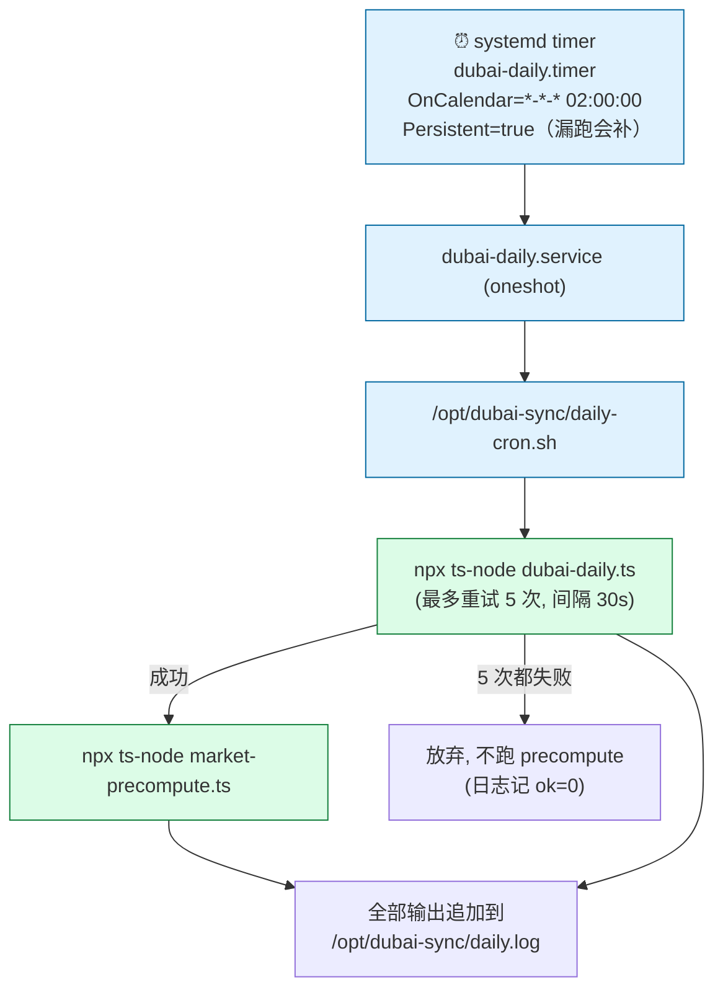
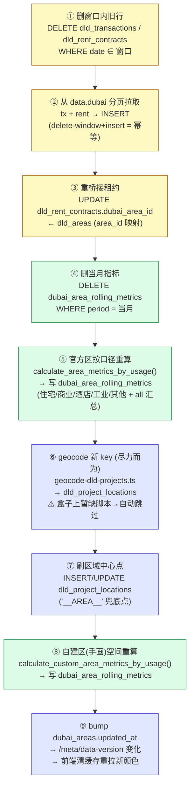
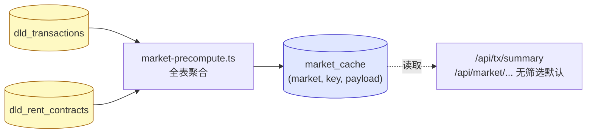
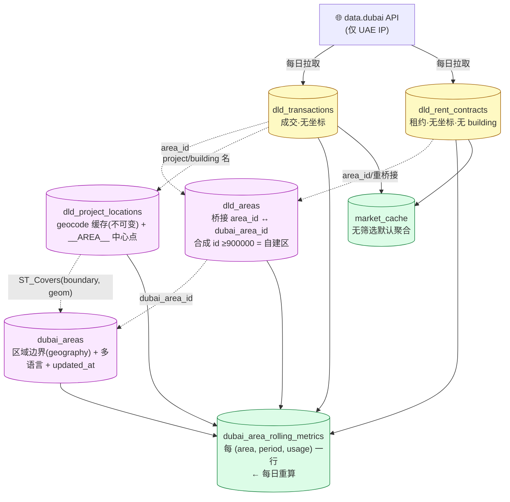
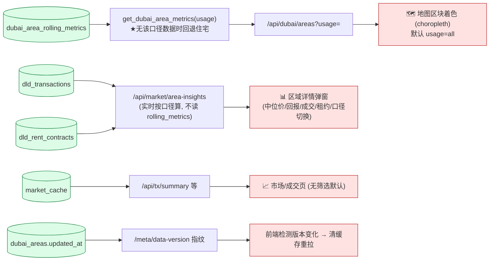

# 每日 Job 全貌（Daily Jobs Overview）

> 更新：2026-06-26 · 描述当前每天自动运行的任务、它们改哪些表、表之间的关系，以及前端/接口怎么消费这些数据。

---

## 0. 一句话总览

每天 **02:00**（迪拜盒子 `38.54.8.9` 上的 systemd timer），跑一条数据刷新链：
**从 data.dubai 拉最近一个多月的成交/租约 → 落库 → 重桥接 → 重算区域指标（按口径）→ 刷地图缓存版本 → 预热市场聚合缓存**。

唯一的"数据" cron 在迪拜盒子；Hetzner 服务器上只有基础设施 cron（SSL 证书续期），不碰业务数据。

---

## 1. 调度与编排（谁触发谁）

- **位置**：迪拜盒子 `38.54.8.9`（LightNode，UAE IP，直连 data.dubai 快）。源码在 `/opt/dubai-sync`（**是拷贝的源，不是 git** —— 改了仓库脚本要 scp 同步）。
- **日志**：`/opt/dubai-sync/daily.log`，或 `journalctl -u dubai-daily`。
- **下次运行**：`systemctl list-timers | grep dubai`。

---

## 2. 主 Job：`dubai-daily.ts`（数据刷新 + 重算指标）

按顺序 9 步。窗口 = **上月 1 号 .. 明天**（滚动窗口，捕捉迟到/更正的记录）。

**关键点**
- 步骤 ⑤/⑧ 都写**同一张** `dubai_area_rolling_metrics`：⑤ 官方区走 `area_id` 桥接，⑧ 手画区走 geocode 空间归属。
- 步骤 ⑤ 现在用 **按口径**函数（`calculate_area_metrics_by_usage`），一次产出每个 usage 的行 **+ `all` 汇总行**。**旧函数 `calculate_area_rolling_metrics`（仅住宅）已弃用**——它和现表的 `ON CONFLICT` 不兼容会报错（2026-06-26 修过的坑）。
- 步骤 ⑥ geocode 是 try/catch 尽力而为，失败不影响整条链。

---

## 3. 次 Job：`market-precompute.ts`（市场聚合缓存预热）

主 Job 成功后才跑。把**最贵的"无筛选默认"聚合**（全表 ~百万行 percentile/mode/group-by，冷查要 6–14s）预算好存进 `market_cache`，让接口直接读缓存秒回。

写入的 `market_cache` 行：`('rent','summary')`、`('tx','summary')`、`('tx','filters')`、`('tx','projects:ALL')` 等。

---

## 4. 表关系（数据从哪来、到哪去）

| 表 | 角色 | 每日 job 怎么动它 |
|---|---|---|
| `dld_transactions` | 成交真相（无经纬度） | ①删窗口 ②重插 |
| `dld_rent_contracts` | 租约真相（无 building、78% 只到区） | ①删窗口 ②重插 ③重桥接 dubai_area_id |
| `dld_areas` | area_id ↔ dubai_area_id 桥接表 | 只读 |
| `dubai_areas` | 区域边界 + 多语言 + 颜色 + updated_at | ⑨ bump updated_at（自建区） |
| `dld_project_locations` | geocode 缓存 + `__AREA__` 兜底中心 | ⑥geocode新增 ⑦刷中心点 |
| `dubai_area_rolling_metrics` | **地图着色的数据源**（按口径） | ④删当月 ⑤官方重算 ⑧自建重算 |
| `market_cache` | 市场页无筛选聚合缓存 | precompute 覆盖写 |

---

## 5. 谁消费这些数据（前端/接口）

**重要区分**
- **地图区块颜色** 来自 `dubai_area_rolling_metrics`（预算表，每日重算）。这张表被清空过 → 地图变白（已加回退护栏，再不会白）。
- **区域详情弹窗** 的指标/成交/租约是 **实时**从 `dld_transactions`/`dld_rent_contracts` 算的，**不依赖** rolling_metrics —— 所以即使预算表出问题，弹窗也照常。
- **前端缓存刷新** 靠 `/meta/data-version` 指纹（含 `MAX(dld_transactions.created_at)` + `MAX(dubai_areas.updated_at)` + landmarks）；所以每日 job 步骤 ⑨ bump `updated_at` 是让客户端看到新颜色的关键。

---

## 6. 其它（非数据）定时任务

| 任务 | 位置 | 频率 | 作用 |
|---|---|---|---|
| `certbot renew` | Hetzner API/worker 服务器 | 每日（cron） | 续期 Let's Encrypt SSL 证书（upload-api 用），不碰业务数据 |
| `apt-daily` / `apt-daily-upgrade` | 迪拜盒子 | 系统默认 | OS 包更新，与本系统无关 |

> Hetzner 的 **API/worker 服务器没有数据 cron**；worker 是"轮询数据库取 PDF 任务"持续运行，不是每日定时。

---

## 7. 排障速查

| 现象 | 查哪里 |
|---|---|
| 地图没颜色 | `SELECT usage, count(*) FROM dubai_area_rolling_metrics WHERE period_end_month=(SELECT max(period_end_month) FROM dubai_area_rolling_metrics) GROUP BY usage` —— 应有 all + 各口径 |
| 每日 job 是否跑了/报错 | 盒子 `tail -50 /opt/dubai-sync/daily.log` 或 `journalctl -u dubai-daily` |
| 数据新鲜度 | `SELECT max(instance_date) FROM dld_transactions; max(start_date) FROM dld_rent_contracts` |
| 前端没刷新到新数据 | 看 `/api/meta/data-version` 指纹是否变了；步骤 ⑨ bump 了没 |
| 改了指标函数/表结构后 | **记得 scp 新版 `dubai-daily.ts` 到盒子**（盒子非 git） |

相关 spec：`docs/dubai-sync-architecture.md`、`docs/dubai-data-rebuild-plan-2026-06-18.md`、`docs/area-metrics-overhaul-2026-06-19.md`。
