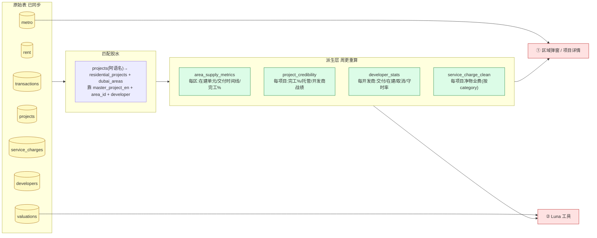

# DLD 数据处理与应用 Proposal —— 从原始表到分析

> 日期：2026-06-26 · 作者：Claude
> 目标：把已接入的 DLD 数据集**加工成可用信号**,并落到两个出口 ——
> **① 区域详情(area block)展示** 和 **② Luna AI 分析**。

---

## 0. TL;DR

我们现在手里的原始数据(每日/每周已自动同步)远超"成交+租约"。真正的价值不在原始表,在**加工层**:把它们算成几个**新信号**——**供给压力、项目可信度、开发商战绩、净回报、官方估值对标、地铁可达** ——再用统一的方式喂给区域弹窗和 Luna。

核心原则(延续既有约定):**不藏数据、按口径算、标 DLD 来源、标"指示性非保证"**。

**最高价值的一条**:`dld_projects` 的 **供给管线**(在建单元数、未来交付时间线、完工%)—— 这是目前投资分析**最缺**的一块,直接回答"这个区会不会供给过剩 / 这个期房靠不靠谱"。

---

## 1. 现在手里有什么(原始层)

| 表 | 频率 | 关键字段 | 解锁的分析 |
|---|---|---|---|
| `dld_transactions` | 日 | 成交价/㎡、面积、usage、master/project/building | 已用:comps、价格、成交量、回报 |
| `dld_rent_contracts` | 日 | 年租、面积、新签/续租 | 已用:毛回报、租赁稳定性 |
| `dld_valuations` | 周 | 官方估值、property_total_value | **新**:估值 vs 成交价对标 |
| `dld_projects` | 周 | **percent_completed / project_status / escrow_agent / developer / no_of_units·buildings·villas / dates** | **新**:供给管线、项目可信度 |
| `dld_oa_service_charges` | 周 | service_cost(按 project×year×category) | **新**:净回报(需按 category 清洗) |
| `dld_developers` | 周 | developer_name_en / license / legal_status / expiry | **新**:开发商背调 |
| `rta_metro_stations` | 周 | 官方经纬度 / line_name | **新**:校准"到地铁距离" |

---

## 2. 加工架构:原始 → 派生 → 出口

**三层模式**(跟现有 `dubai_area_rolling_metrics` 一致):
1. **原始层**:已同步(日/周)。
2. **派生层**:几张物化表/视图,**在周更 job 里重算**(projects/service 同步后),区域弹窗和 Luna 直接读,快。
3. **匹配胶水**:`dld_projects` 项目名是**阿拉伯语**,要靠 `master_project_en` + `area_id` + 开发商 把它对到我们的 `residential_projects` / `dubai_areas`(类似现有 geocode 匹配层)。这是最关键的一步工程。

---

## 3. 六个新信号(怎么算、长什么样)

### 3.1 供给压力(⭐最高价值)—— from `dld_projects`
- **每区聚合**:`SUM(no_of_units) WHERE status='ACTIVE'`(在建单元)、按 `completion_date`/`project_end_date` 的**未来 1/2/3 年交付时间线**、`AVG(percent_completed)`、ACTIVE/NOT_STARTED/FINISHED 项目数。
- **信号**:在建+未交付单元 ÷ 区域现有存量 → **供给压力指数**。高 = 未来租金/价格承压;低 = 紧俏。
- **出口**:区域弹窗新增「**供给**」区:在建单元数、未来交付柱状图(按年)、平均完工%。Luna:`area_supply_outlook(area)`。

### 3.2 项目可信度 —— from `dld_projects` + `dld_developers`
- **每项目**:完工% + 状态 + 是否有 escrow_agent + 开发商战绩。
- **信号**:可信度卡 ——「90% 完工、有托管、开发商已交付 12 个项目」vs「0% 完工、无托管、新开发商」。
- **出口**:项目详情页「可信度」卡;Luna:`check_project_credibility(project)`(直接回应外部 AI 说我们"缺托管状态")。

### 3.3 开发商战绩 —— from `dld_projects` group by developer + `dld_developers`
- **每开发商**:已交付(FINISHED)数、在建数、取消(cancellation_date)数、**守时率**(completion_date vs project_end_date)、牌照是否有效。
- **出口**:项目详情/Luna:`developer_track_record(developer)`。

### 3.4 净回报(精修)—— from `dld_oa_service_charges`
- **按 category 清洗**(排除一次性基金如 Reserved Fund,只取 per-sqft 运营类)→ 每项目/区物业费 AED/㎡ → 净回报 = 毛回报 − 物业费影响。
- **出口**:精修现有净回报(现在用估算);区域弹窗/项目详情的回报标注「官方物业费」。

### 3.5 官方估值对标 —— from `dld_valuations`
- 成交价/报价 vs 官方估值 → 「官方估值 X,成交 Y,溢价 Z%」。
- **出口**:Luna `project_value_check` 增强;项目详情价格体检加一条官方估值线。

### 3.6 地铁可达(校准)—— from `rta_metro_stations`
- 用官方 RTA 坐标替换现在 POI 的地铁点 → 每项目/区最近站 + 线路 + 步行分钟。
- **出口**:`present_place` 环境站、amenity 评分用官方地铁坐标。

---

## 4. 两个出口怎么落

### ① 区域弹窗(area block)
现有:口径切换 + 成交/租金/项目 三 tab。**新增**:
- 「**供给**」小区块或第 4 个 tab:在建单元数 + 未来交付柱状图 + 平均完工% + 供给压力标签(紧俏/均衡/承压)。
- 「市场行情」里回报旁标「官方物业费/净回报」。
- 项目 tab 的卡片加完工%/状态徽章(对到 dld_projects 的)。

### ② Luna AI 分析(新增/增强工具)
| 工具 | 作用 | 数据源 |
|---|---|---|
| `area_supply_outlook(area)` | 该区未来 N 年交付多少单元、供给松紧 | area_supply_metrics |
| `check_project_credibility(project)` | 完工%/托管/开发商战绩→靠不靠谱 | project_credibility |
| `developer_track_record(developer)` | 交付/取消/守时率/牌照 | developer_stats |
| (增强)`present_place` | 序列带看加一站「供给与可信度」 | 上面几个 |
| (增强)`area_investment_report` | 报告加"供给压力""官方估值"两段 | supply + valuations |

Luna 台词延续约定:短、标"指示性"、不藏负面(供给过剩也如实说)。

---

## 5. 分期 Roadmap

| 阶段 | 内容 | 价值 |
|---|---|---|
| **P1** | 匹配胶水(projects→区/项目)+ `area_supply_metrics` + 区域弹窗「供给」+ Luna `area_supply_outlook` | ⭐⭐⭐ 最缺的供给视角 |
| **P2** | `project_credibility` + `developer_stats` + 项目详情可信度卡 + Luna 两个工具 | ⭐⭐⭐ "真实数据"卖点 |
| **P3** | service_charge 按 category 清洗 → 精修净回报 | ⭐⭐ |
| **P4** | 官方估值对标 + 官方地铁坐标校准 | ⭐⭐ |

---

## 6. 诚实的前提/坑(必须先解决)
1. **匹配胶水是地基**:`dld_projects`/`units` 等项目名是**阿拉伯语**,必须靠 `master_project_en`+`area_id`+开发商对到英文项目。匹配质量决定一切——建议先做一个 `resolve_dld_project()` 解析+缓存(类似现有 geocode 缓存)。
2. **物业费脏**:`service_cost` 混了费率和一次性基金,净回报要按 category 白名单清洗,别裸 SUM。
3. **人口数据**:`dsc_population` 当前 slug 无人口数值,需登门户找对的 slug,暂不做。
4. **重活放周更**:派生层在周更 job 算(projects/service 同步后),别拖慢日更/接口。
5. **未接的重表**(units/buildings/land,百万行):供给单元数 `dld_projects` 已直接给(no_of_units),**暂不全量拉**;真要做单元级供给再单独评估增量方案。

---

## 7. 建议下一步
先做 **P1 的匹配胶水 + 供给信号** —— 这是投资分析最缺、也最能立刻让区域弹窗和 Luna "聪明一截"的部分。要我开做吗?(先 `resolve_dld_project()` 匹配层 + `area_supply_metrics` 周更,再上区域弹窗「供给」和 Luna 工具。)
