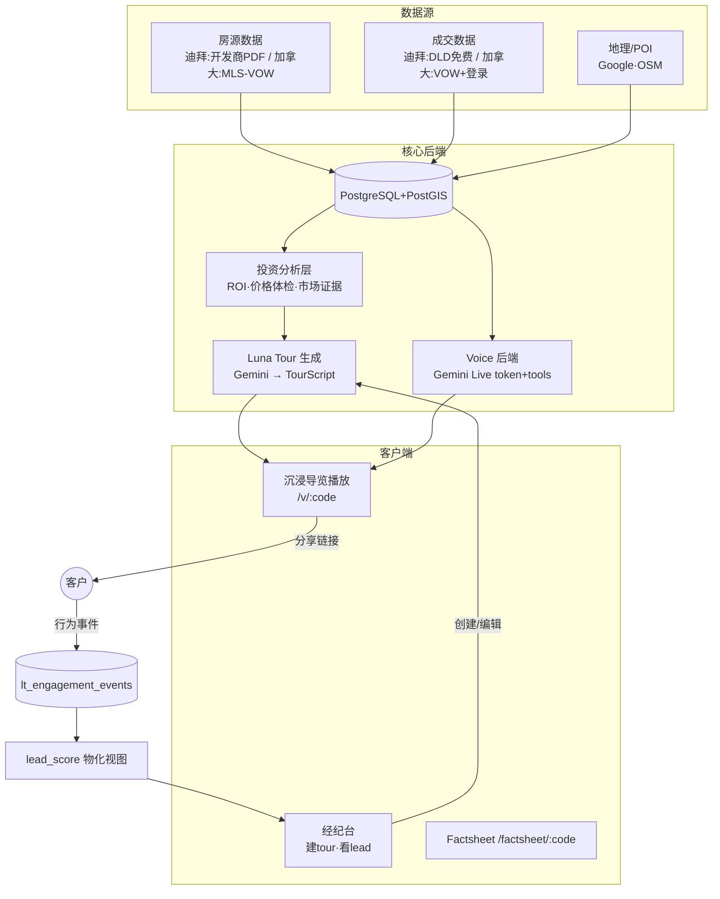

# FindHomeGo 系统规格 — 可移植复刻文档(从 Pinzos/Gulf Property 迁移)

> **本文档用途**:供 AI 在 `findhomego` 项目中复刻 Pinzos 的核心系统(尤其 AI 沉浸式导览 Luna Tour + 客户行为追踪→Lead)。
> 目标市场为**加拿大**(原系统为迪拜),第 8 节专门说明哪些假设要换。
> **给接手 AI 的指令**:先读第 2 节(定位)和第 8 节(加拿大适配)再动手——很多迪拜特定假设在加拿大失效,照搬会错。技术实现细节在第 5–6 节,数据结构请按原文复刻。

---

## 1. 一句话定位
给**经纪人和开发商**的工具:用 AI 把房产(尤其 presale 期房)做成带运镜+AI配音的沉浸式导览,分享给客户,**追踪客户每一步行为并算出热线索(lead score)**,帮经纪促成成交。不做 C 端找房门户。核心差异化:中文/多语 + 沉浸导览 + 基于真实成交数据的投资分析,三合一。

---

## 2. 系统总览



**读图**:房源+成交+地理数据进 PostGIS;投资层算 ROI/价格体检;Tour 生成器用这些数据让 Gemini 产出 TourScript;经纪分享导览给客户;客户每一步行为回流成事件 → 算 lead score → 经纪台看谁最热去跟进。**这个"行为→lead"回流闭环是产品的商业核心。**

---

## 3. 架构

- **双进程**:轻量 API(上传/查询/分享)+ 重负载 Worker(PDF 提取、音频生成),Worker 独立进程轮询 DB 队列。
- **存储**:PostgreSQL + PostGIS(地理查询);Cloudflare R2(图片/音频/PDF 冷存储)。
- **AI**:Gemini(tour 生成、PDF 多模态提取、Live 语音);TTS 预生成音频存 R2,前端加载失败降级浏览器 SpeechSynthesis。
- **认证**:Supabase(经纪/管理员);客户端看导览无需登录(share_code + 可选 passcode)。
- **前端**:React + Vite + TypeScript;地图 MapLibre/Mapbox GL;i18n(中/英/阿 → 加拿大改中/英/法)。

---

## 4. 数据模型(核心表)

### 房产域(通用)
- `residential_projects`:项目(name, developer, area, lat/lng GEOGRAPHY, min/max_price, status, images[], payment_plan jsonb)
- `project_unit_types`:户型(project_id FK, bedrooms, bathrooms, area_sqft, price, floor_plan_image, unit_images[])
- `dubai_areas`(→加拿大改 `areas`):区域 polygon GEOGRAPHY + 滚动指标
- `dubai_pois`:POI point GEOGRAPHY(学校/医院/交通/商场,分类)
- `dld_transactions` / `dld_rent_contracts`(→加拿大改 MLS sold/rent feed):成交+租约,支撑投资分析

### Luna Tour 域(全套 `lt_*` 表 — 复刻重点)
```
lt_agents              经纪账户(认证+品牌名片)
lt_brokerages          经纪行
lt_clients             CRM 客户
lt_demo_sessions       导览会话(share_code UNIQUE, status, is_published, passcode?, expires_at?)
  ├─ lt_session_properties  房源冻结快照(发布后不再拉,防数据漂移)
  ├─ lt_tour_scripts        TourScript v2(jsonb, per session+language)
  ├─ lt_audio_assets        预生成音频 URL(per beat)
  └─ lt_session_news_items  政策/新闻卡(可选)
lt_engagement_events   ★行为事件(visitor_id, event_type, project_id?, dwell_ms?, payload jsonb, ip_hash)
lt_client_feedback     ★反馈(reaction: love|like|dislike|maybe)
lt_session_lead_scores ★lead score 物化视图(定时刷新)
lt_subscriptions       订阅计划
lt_usage_counters      月配额计费
```
所有表 `lt_` 前缀,与房产表仅通过 project_id 软关联(无硬 FK),便于整块移植/卸载。

---

## 5. 子系统详解

### 5A. 数据采集
- **迪拜**:开发商上传楼书 PDF → R2 → Worker(LangGraph 多 agent + Gemini)→ 结构化提取(项目/户型/付款计划/面积)→ DB。已做的关键能力:section-based 户型边界识别、孤儿户型图吸收、跨 PDF 价格匹配、poppler 分片转图。
- **加拿大**:房源来自 MLS,**不需要 PDF 提取作主路径**(但 presale 楼书提取仍有用)。主路径改为 MLS/VOW feed 同步入库。详见第 8 节。

### 5B. 地图与地理(PostGIS)
- lat/lng → 区域:`ST_Contains(area.boundary, point)`
- POI bbox 查询:`location && ST_MakeEnvelope(...)`
- 最近设施距离:`ORDER BY ST_Distance(location, center) LIMIT 1` → 用于导览的 amenity_spokes / distance_line

### 5C. 投资分析层
- `calculateInvestment5yr()`:5 年 = 累计租金(price×yield%×5)+ 增值(price×(1+growth%)^5 − price)
- `calculatePaybackYears()` = 100 / yield%
- **价格体检**:单价 vs 同区成交中位数(基于 sold data)
- **市场证据 `MarketEvidence`**:窗口内成交量、median_psf、3-5 笔可比成交 + **数据源引用 + disclaimer**(投资数字必须标注"基于历史、非承诺",这是信任红线)

### 5D. Voice 助手
- 后端 `/api/voice/token` 发 Gemini Live 临时 token(密钥留后端);`/api/voice/tools/execute` 执行 25+ 工具(搜索/飞行/区域信息/投资预测/可购力)。
- 前端 pill 按钮 + 气泡,Gemini Native Audio 实时语音 + 工具调用。

### 5E. Luna Tour(沉浸导览 — 复刻核心)

**数据结构 `TourScript v2`**(`backend/src/luna-tour/tour-script.types.ts`,zod schema,请按原文复刻):
```ts
TourScript = { version:2, voice, language, total_ms, theme?, intro:Beat, acts:Act[], outro:Beat }
Act  = { id, property_id, beats:Beat[], transition_out?, place?:{name,coords:[lng,lat]} }
Beat = { id, kind?:'arrival'|'life'|'numbers', narration, audio_url?, duration_ms, camera:Camera[], overlays:Overlay[] }
```
- **每个房源三段式 Beat**:arrival(飞入/环境)→ life(配套/交通)→ numbers(ROI/成交数据)。
- **Camera 运镜**:`{at_ms, center:[lng,lat], zoom, pitch, bearing, duration_ms, easing}`;特殊动作 `orbit`(原地旋转 degrees)、`flyover`(A→B 抛物飞跃)。
- **Overlay 卡片**:title / property_card / roi_card / distance_line / amenity_spokes / favorite_picker / cta / progress_dots / media。

**时间线引擎(`engine/TimelineEngine.ts` + cameraTrack.ts + audioTrack.ts)— 7 条必守原则**:
1. **ONE CLOCK**:整个导览只有一个 rAF 时钟驱动运镜+音频+overlay,暂停时全冻结(无二级时钟、无异步跳动)。
2. **事件驱动推进**:beat 前进需同时满足「旁白播完 AND 最小驻留(1500ms) AND 运镜完成」三个 gate,不靠猜时长。
3. **运镜时间压缩**:camera track 编译成固定时长,引擎按实际音频长度 `camScale` 缩放采样速度,使运镜与旁白同步。
4. **Bearing 分离**:旋转由引擎恒速驱动(跨 beat 连续),不受 camScale 影响,防镜头跳。
5. **冻结快照**:`lt_session_properties.snapshot` 存全量房源数据,发布后不再拉,防演示数据漂移。
6. **音频降级**:优先 R2 预生成 mp3,失败降级浏览器 TTS,再失败有 backstop 时长自动推进。
7. **AI prompt 强约束**:每个坐标/价格/距离必须来自给定事实,禁止编造;禁用词;guardrails(不承诺确定回报)。

**生成流程**(`tour-generator.ts` + `session-builder.ts`):
```
TourInput{client, config, properties[]} → buildPrompt() → Gemini(gemini-3.5-flash)
  → JSON → zod parse(TourScriptSchema) → validate(timing/refs/duration±20%) → 失败反馈重试一次 → 存 lt_tour_scripts
```
`TourProperty` 喂给生成器的字段:id, name, coords, min/max_price, investment{buy,future,growth_pct,yield_pct,payback_years}, amenity_score, amenity_tier, distances[], amenities[]。

**编辑器**(`TourEditor.tsx`):NLE 时间线,编辑 narration/overlay timing/上传媒体 → `PATCH /sessions/:id/script` → 重生成该 beat 音频。

### 5F. 客户行为追踪 → Lead(★商业核心,复刻重点)

**事件类型**(`telemetry.ts`,fire-and-forget,sendBeacon,错误全吞,绝不影响播放):
```
open | tour_play | property_dwell(dwell_ms) | chart_view | tour_complete
| tour_replay | cta_whatsapp | cta_call | feedback(reaction) | property_view | ask
```
自动埋点(`useTourTelemetry.ts` 观察引擎快照):open(加载)、property_dwell(离开房源段记驻留)、chart_view(进入 numbers beat)、tour_complete(到 outro)。手动:CTA/feedback/replay/ask。

**上报与存储**:`POST /public/v/:code/event` → `lt_engagement_events`(session_id, visitor_id, event_type, project_id?, dwell_ms?, payload, ip_hash);feedback 额外写 `lt_client_feedback`。

**Lead Score 公式**(物化视图 `lt_session_lead_scores`,定时刷新):
```
lead_score = opens×1 + tour_completes×5 + tour_replays×3 + cta_clicks×10 + LEAST(total_dwell_ms/60000, 20)
```
权重逻辑:打开=1(基础)、完看=5(意图)、重看=3、点 CTA=10(强信号)、观看分钟数封顶 20。
示例:打开+完看+联系+看5分钟 = 1+5+10+5 = 21(热);打开+看2分钟 = 3(冷)。

**经纪台聚合**(`agent-router.ts` `GET /agent/sessions`):每个导览返回 opens/completes/cta_clicks/loves/total_dwell_ms/lead_score,前端按 lead_score 排序取 Top5 热线索。

---

## 6. 关键流程时序(端到端)
```
经纪选 2-4 个房源建 session
  → 生成器调 Gemini 产 TourScript → 音频管道预生成 mp3 到 R2
  → 经纪编辑器微调 → 发布(生成 share_code)
  → 分享链接 /v/:code 发给客户
  → 客户打开 → ONE CLOCK 引擎播放(地图运镜+旁白+overlay)
  → 每步行为 → lt_engagement_events → lead_score 物化视图
  → 经纪台看 Top 热线索 → 按 CTA/dwell 跟进 → 成交
```

---

## 7. 技术栈与外部依赖
- 后端:Node/Express + TypeScript;PostgreSQL+PostGIS;zod(schema 校验)
- AI:`@google/genai`(Gemini 生成/Live);TTS(音频预生成)
- 存储:Cloudflare R2
- 前端:React+Vite+TS;MapLibre/Mapbox GL;i18next;Framer Motion
- 认证:Supabase
- 部署:容器(API + Worker 两镜像);worker 需 poppler-utils(若保留 PDF 提取)

---

## 8. 移植到 FindHomeGo / 加拿大的适配指南(必读)

> 详细市场依据见 `docs/reports/2026-06-13-canada-proptech-feasibility.md`。这里给**工程上要改什么**。

### 失效的迪拜假设 → 加拿大替换
| 维度 | 迪拜(原系统) | 加拿大(必须改) |
|---|---|---|
| **客群** | 海外买家(中文是远程刚需) | **本地华人 PR/公民**(列治文 47.9% 华裔、万锦 43.3%,不受外国买家禁令)。中文优势仍在,但定位从"远程看房"转"中文服务本地刚需" |
| **成交数据** | DLD 免费公开 API | **MLS sold price 被 board(TRREB/REBGV)锁住**,只能经 **VOW feed + 持牌 brokerage 会员 + 用户登录**展示(HouseSigma/Wahi 都这么干)。→ 投资分析/价格体检要先解决数据获取:做持牌 brokerage 或与之合作 |
| **房源采集** | 开发商上传 PDF | MLS/VOW feed 同步为主路径;PDF 提取保留给 presale 楼书 |
| **外国买家** | 核心卖点 | ⚠️ **合规红线**:外国买家禁令至 2027-01-01,罚款含"协助方(经纪/平台)"。产品**不得帮非加拿大人购买受限住宅**;聚焦合规客群(PR/工签/4+单元) |
| **语言** | 中/英/阿 | 中/英/法 |
| **佣金** | 2% 买方付 | 4–5% 卖方付双边(正被集体诉讼冲击,RE/MAX 2025 已和解) |

### 反而更强的假设(加拿大本土空白)
- **中文 + AI**:本土中文平台(房大师等)UX 老旧、缺 AI,可弯道超车;华人客群规模大、语言独特、已验证付费意愿。
- **AI 沉浸导览 + AI 投资 ROI**:加拿大**无本土 AI 沉浸导览**;presale 冷静期(BC 7 天 / 安省 10 天)真实存在,"看渲染图"前提成立。
- **presale 仍是导览真实场景**,但 ⚠️ **时机差**:2024–25 GTA 新公寓崩盘(2025 全 GTA 12 月仅卖 87 套,库存 78 个月)。卖点要从"帮开发商拉需求"转成"省钱替代实体售楼处 + 给经纪做差异化 demo"。

### 不要做
- 纯 iBuyer(Properly 已失败退出)
- 和 Realtor.ca/HouseSigma 正面拼数据/流量门户

### 移植技术清单
**直接复用**(市场无关):Luna Tour 全套(TourScript schema + ONE CLOCK 引擎 + cameraTrack + audioTrack + 编辑器)、telemetry→lead 全套(事件 schema + lt_engagement_events + lead_score 视图 + 经纪台聚合)、Voice 框架、PostGIS 地理层、投资计算公式。
**必须替换**:数据源接入层(DLD API → MLS/VOW)、客群/文案/语言、合规校验(外国买家禁令)、佣金/定价模型。
**核心要建的表**:lt_* 全套 13 张 + areas/pois/sold 数据表。
**核心模块**:tour-script.types / tour-generator / session-builder / audio-pipeline / public-router / agent-router / evidence + 前端 engine/* + telemetry。

---

## 9. 相关文档
- 加拿大市场可行性:`docs/reports/2026-06-13-canada-proptech-feasibility.md`
- 迪拜市场/变现:`docs/reports/2026-06-13-dubai-market-analysis-monetization.md`
- 竞争力判断/聚焦:`docs/reports/2026-06-13-competitive-honest-take-and-focus.md`
- 系统/产品评估:`docs/reports/2026-06-13-system-assessment-and-monetization.md`
