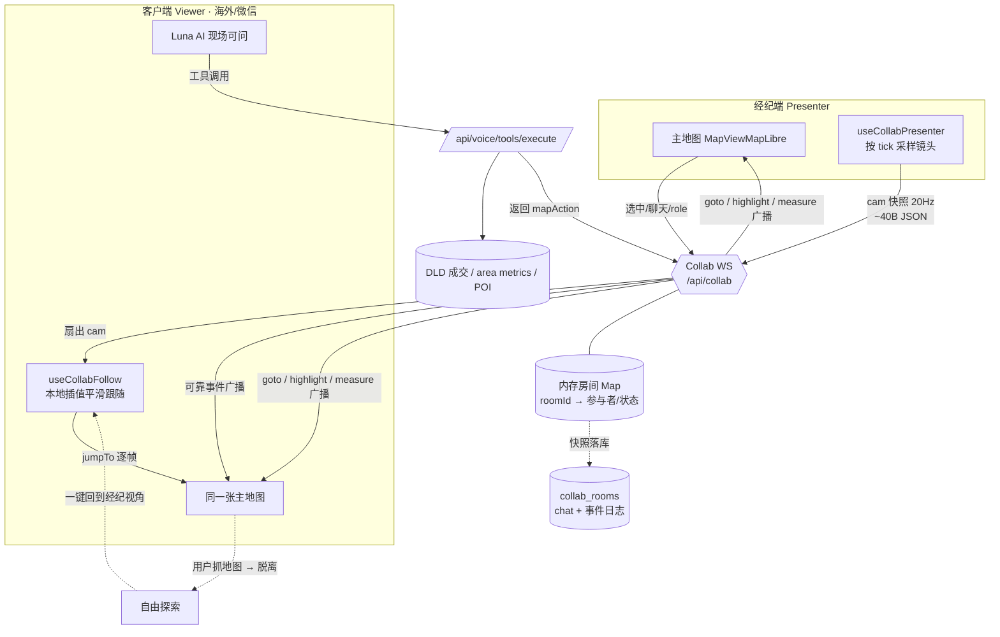
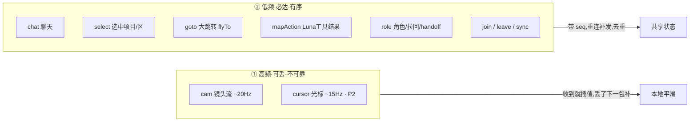
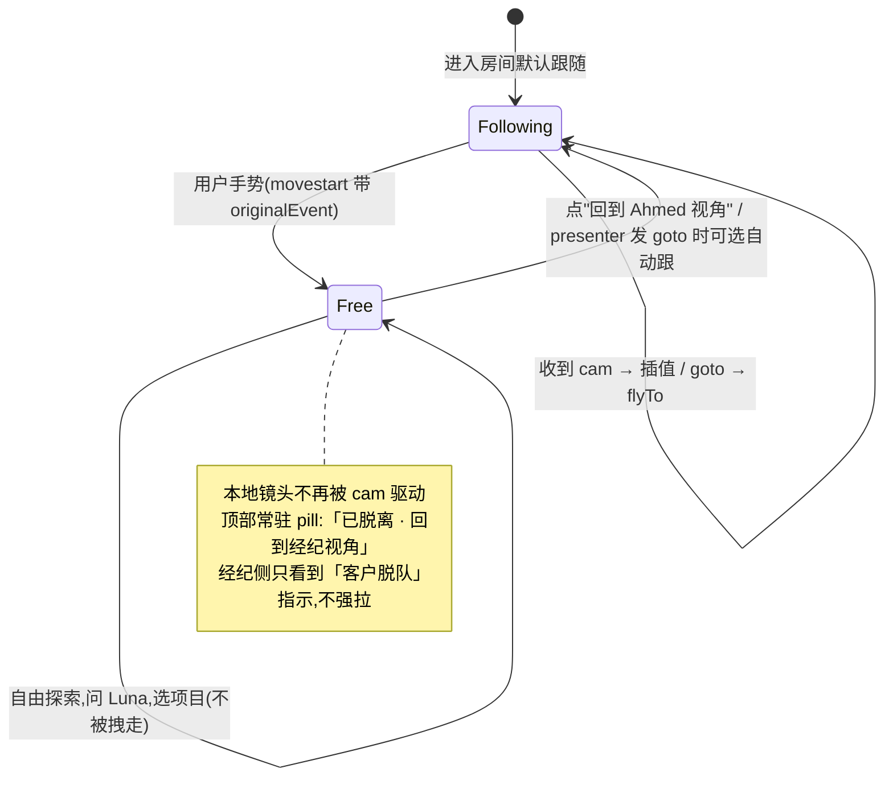
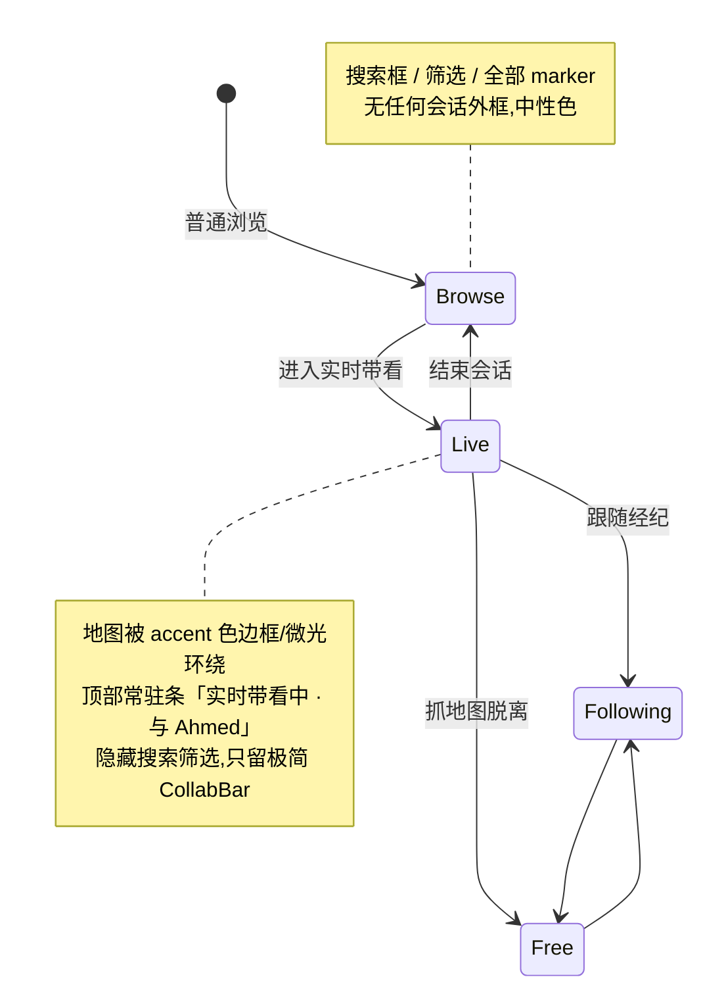
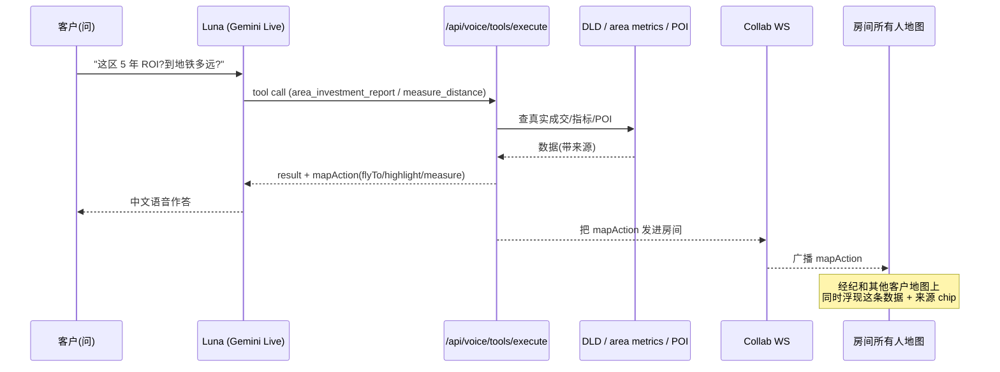
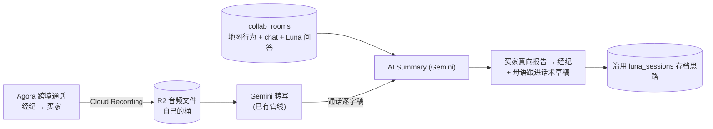
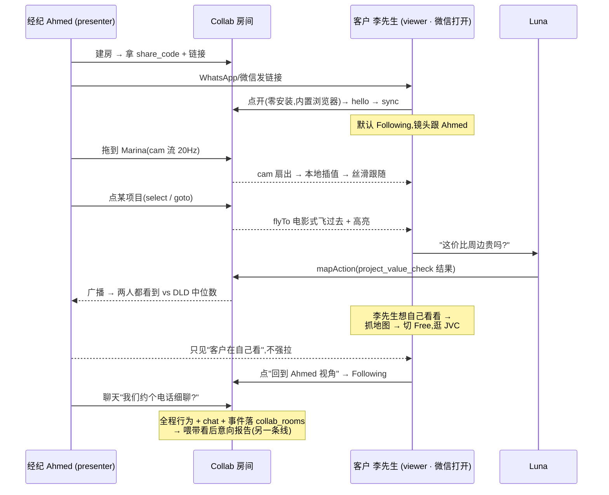

# Luna 实时协作带看(Co-Presence)—— 系统设计 Spec

状态:**MVP 已上线生产**(2026-06-20)· 接手指南见下方 §H
归属:Luna Tour(B2B2C 高端经纪 demo SaaS)下的实时协作模块
前置评估:`docs/reports/2026-06-20-collaborative-map-commercial-value.md`

---

## H. 实现现状与接手指南(Handoff · 2026-06-20)

> 后面 §0–§12 是设计原文。本节是**实际落地了什么 + 怎么测 + 还剩什么**,接手先读这里。

### H.1 现状一句话
MVP 已实现、本地+生产双重端到端验证通过、已部署上线(commit `15b6379`)。经纪在 `pinzos.com` 登录点「开始带看」→ 分享 `pinzos.com/t/<code>` → 客户免登录进房,镜头跟随经纪、能聊天、能脱离自己逛再跟回、能问 Luna。**人声 MVP 走线下电话**(Agora 是第二阶段)。

### H.2 代码地图

**后端**
| 文件 | 作用 |
|---|---|
| `backend/src/routes/collab.ts` | `initCollabWebSocket(server)`(noServer + `/api/collab` upgrade 路由)+ REST:`POST /api/collab/rooms`、`GET /api/collab/rooms/:code`、`GET /api/collab/health`。协议处理 / seq / ring / resume / 25s ping / join·leave。**`persistRoomEvent` 是 DB 持久化 stub(空)**。 |
| `backend/src/services/collab-rooms.ts` | 内存房间 `Map`:`createRoom/getRoomByCode/joinRoom/leave/nextSeq/pushReliable/fanout/startRoomGc`。分享码 5 位(去 0/O/1/I)。空房 10 分钟回收。 |
| `backend/src/routes/voice-chat.ts` | **改为 noServer + 自管 upgrade**(WS 多 path 修复,见 H.5)。 |
| `backend/src/index.ts` | 注册 collab router + `initCollabWebSocket(server)`。 |
| `backend/scripts/test-collab.ts` | WS 集成测试(19 断言)。`cd backend && npm run test:collab`。 |

**前端**(全在 `frontend/src/luna-tour/collab/`,除标注外)
| 文件 | 作用 |
|---|---|
| `protocol.ts` | 消息类型、`Cam`、`RELIABLE_KINDS`、`collabWsUrl()`(http→ws/https→wss)。**协议事实源**。 |
| `follow-math.ts` | `lerp/lerpAngle/stepCamera/cameraConverged/shouldSendCam/classifyMove`。netcode 数学心脏。 |
| `CollabClient.ts` | 框架无关连接:hello / 指数退避重连 / 心跳 / seq 去重 / resumeSeq。 |
| `useCollabSocket/Presenter/Follow.ts` | 三个薄 React hook。 |
| `useCollab.ts` | 给 MapPage 用的组合 hook(browse 模式零挂载)。 |
| `collab-actions.ts` | 纯决策函数(`selectMessage/chatMessage/shouldStoreRemoteTarget`)。 |
| `collabApi.ts` | REST 包装 `createCollabRoom/getCollabRoom`。 |
| `CollabBar.tsx` | 参与者圆点 / 聊天面板 / 🎤 disabled 占位 / Free 时「回到 X 视角」pill。 |
| `CollabFrame.tsx` | accent 模式外框 + 「实时带看中·与 X」session 栏 + presenter 分享链接条。 |
| `__tests__/collab.test.ts` | 15 单测。`npx tsx --test src/luna-tour/collab/__tests__/collab.test.ts`。 |
| `components/MapViewMapLibre.tsx` | 加可选 `onMapReady?(map)` prop,其余零改动。 |
| `pages/MapPage.tsx` | 三模式(browse/presenter/viewer)、`isCollabViewerPath` 守卫、`useCollab` 接线、movestart 脱离、「开始带看」(owner)、select/mapAction 广播。 |
| `App.tsx` | 公开路由 `/t/:code` → MapPage。 |
| `lib/config.ts` | `ENV` 兜底,使模块能在 node(测试)下 import。 |
| `scripts/test-collab-e2e.mjs` | Playwright 端到端冒烟(node 扮 presenter + 真浏览器 viewer)。`BE=.. FE=.. node scripts/test-collab-e2e.mjs`。 |

### H.3 路由(别再撞车)
- `/v/:code` = **luna-tour 公开观看**(既有,另一套)。
- `/t/:code` = **collab viewer**(本功能,公开免登录)。
- `MapPage` 里 `isCollabViewerPath` 守卫确保 `/t/` 的 `:code` **不喂给 `tourCode`**,否则会叠加 luna-tour 的"导览不存在" overlay。

### H.4 怎么验证(三条命令 + 一个 e2e)
```bash
cd backend && npm run test:collab                                   # 后端 19 断言
cd frontend && npx tsx --test src/luna-tour/collab/__tests__/collab.test.ts   # 前端 15 单测
# 端到端(需先起 backend npm run dev + frontend npm run dev):
cd frontend && BE=http://localhost:3000 FE=http://localhost:5174 node scripts/test-collab-e2e.mjs
# 生产复验:BE=https://api.pinzos.com FE=https://pinzos.com node scripts/test-collab-e2e.mjs
```

### H.5 已知坑(必看)
**同一 http server 多个 WebSocketServer 必须用 `noServer` + 自管 upgrade**,不能用 `{server,path}`——先注册的 WSS 会把别的 path 的握手 abort 成 400。voice-chat 和 collab 都已按 noServer 写。以后加任何 WS 端点照此,且**必须用真 WS 客户端测**(health 检查查不出)。

### H.6 部署
- 后端:改完跑 `backend/quick-deploy.ps1`(docker 镜像 → Hetzner,~3 min)。
- 前端:push 到 `main` → Cloudflare Pages 自动部署(~1-2 min)。
- WS 穿 Cloudflare 橙云正常,25s 应用层 ping 处理 100s 空闲超时,无需额外 CF 配置。

### H.7 待办(按优先级)
1. **微信内置浏览器真机冒烟**(owner 手动,头号验收):微信打开 `/t/<code>`,验 WebGL 地图 / WS / autoplay 跑通。
2. **DB 持久化**:`persistRoomEvent` 落 `collab_rooms`(chat + 事件日志),供带看后意向报告(沿用 `luna_sessions` JSONB 思路)。现为空 stub。
3. **第二阶段人声 = Agora**(§8.5):App ID + 证书 → 接 Cloud Recording → R2 → Gemini 转写 → 意向报告。需双方知情同意。demo ≈ $5/月。
4. **viewer 沉浸打磨**:viewer 模式仍露站点顶栏,可隐藏只留地图+外框。
5. **P2 增强**:`cur` 光标共享(GL symbol layer,后端已扇出、前端未渲染)、presenter handoff(`role` 事件后端已支持、无 UI)、>1 客户参与者头像、chat 时间戳穿插排序。
6. **Redis pub/sub**:仅当后端水平扩展到多实例时才需要,现单进程不做。

### H.8 当前实现的取舍(非 bug,有意为之)
- 🎤 静音键 = disabled 占位(应用内语音是第二阶段)。
- `select` 远端:viewer 飞到坐标,不开项目详情弹窗(viewer 是公开页未必有该项目上下文)。
- chat:自己的消息本地乐观回显,恒排在收到消息之后(协议无 chat 时间戳)。

---

## 0. 这个功能到底是什么(钉死范围)

**经纪拿我们的地图给海外客户做"在线导游"的实时系统。** 经纪和客户在同一个地图会话里:

- **能聊天 + 能问 AI**(Luna 查真实 DLD 数据当场作答,所有人都看到)。
- **客户的地图会跟着经纪的镜头走**——但**不是看屏幕直播**。
- 像 **dota2 / 网游联机**:只广播**必要的状态 JSON**(镜头 `{center, zoom, bearing}`、选中、工具结果),客户端用这些 JSON **在本地重建画面并平滑跟随**。绝不 stream 整个屏幕。
- **客户也能自己玩**:随时抓住地图脱离跟随、自由探索,一键再跟回经纪视角。不是看电影,是可以插手的联机。

### 明确复用、不重做(都已存在)
- **单人异步自助 tour**:链接 → 自己逛 → 提问切 Live → 行为埋点。已是 Luna Tour 现状,本 spec **不碰**。
- 分享会话表 `lt_demo_sessions`、公开观看端点 `/api/luna/*`。
- 行为埋点 `app_events` + `/api/events` + `frontend/src/lib/track.ts`。
- 单会话意向报告(带看后给经纪)= 另一条线,不在本 spec。

### 本 spec 唯一交付 = **实时共享层(Live co-presence)**
现有地图 + 现有 Luna,**外挂一个轻量实时同步层**。地图组件本身几乎不改(性能硬规矩要求:运镜帧零 React 重渲染),同步逻辑全部用命令式 hook 直接驱动 maplibre 实例。

---

## 1. 为什么"广播 JSON + 本地重建"而不是屏幕直播

| | 屏幕共享 (Zoom/WebRTC) | **状态广播 (本方案)** |
|---|---|---|
| 带宽 | 0.5–3 Mbps 视频流 | **~1–5 KB/s**(几十字节/包) |
| 客户端画质 | 经纪的分辨率,糊 | **客户本机原生渲染,锐利** |
| 客户能不能插手 | 不能,只能看 | **能,随时脱离自由探索** |
| 客户设备视角 | 跟经纪屏幕死绑 | **自适应客户屏幕尺寸/DPI** |
| 弱网表现 | 卡帧/花屏 | **插值兜底,丢包也顺** |
| 移动端(微信内置浏览器) | WebRTC 各种坑 | **纯 WS + JSON,跑得通** |

结论:期房卖的是地段,地图必须**锐利、可交互、能各看各的**。屏幕直播在这三条上全输。这也是为什么要做成"联机"而非"投屏"。

---

## 2. 系统架构

现有主地图(`MapViewMapLibre`)+ 现有 Luna(Gemini Live),外挂 **Collab 实时层**:一条新的 WS 通道 `/api/collab` + 内存房间 + 客户端的 follow/presenter 两个 hook。



**两类消息,两套保证(网游 netcode 的精髓):**



- **① 高频流**(镜头、光标):发了就忘,**客户端插值兜底**,丢几包无所谓 → 这是"丝滑"的来源。
- **② 可靠事件**(聊天、选中、大跳转、AI 结果、角色):**必达 + 有序**(带 `seq`),重连时按 `seq` 补发、去重。

---

## 3. Netcode:为什么丝滑 —— 解耦"发送频率"和"渲染帧率"

新手会"收一包 `jumpTo` 一下" → 网络抖动直接变成镜头卡顿。**正确做法和 dota2 客户端一样:本地插值。**

### 3.1 Presenter 发送端(采样 + 节流)
```
每 50ms(20Hz)一个 tick:
  读 map.getCenter()/getZoom()/getBearing()/getPitch()  // 命令式,不进 React state
  与上次发的比,变化超过阈值(位移>~1px 等价 / zoom>0.01)才发
  发 cam 快照 { t, c:[lng,lat], z, b, p }   // ~40 字节
镜头静止 ~200ms:发最后一帧 + idle 标志,停止发送(省带宽)
```
- 采样在一个轻量 `setInterval`/rAF 里读 maplibre 实例,**不触发组件重渲染**(守住性能硬规矩)。
- 大跳转(经纪点区、Luna `flyTo`)**不走 cam 流**,走可靠的 `goto` 事件(见 3.3)。

### 3.2 Viewer 接收端(插值,丝滑核心)
```
收到 cam:只更新 target = {c, z, b, p},不直接动地图
本地 rAF 循环(60fps):
  current.c   = lerp(current.c, target.c, k)      // k≈0.18 临界阻尼
  current.z   = lerp(current.z, target.z, k)
  current.b   = lerpAngle(current.b, target.b, k)  // 角度走最短弧
  map.jumpTo(current)                              // 逐帧瞬时,本机 60fps 渲染
当 |current - target| < ε:停 rAF(省电),等下一包唤醒
```
- **指数平滑(临界阻尼)** 而非"按时间戳缓冲":实现极简、对丢包/变速率天然鲁棒,一行 lerp 就买到丝滑。
- 渲染始终是客户本机 60fps,**与到包频率无关** → 20Hz 的包也看着像 60fps 连续运镜。
- 复用 `mapTourHandle.ts` 的 `jumpTo`(已是逐帧瞬时设计,无 jitter)。

### 3.3 大跳转用 `flyTo` 不用插值
连续 lerp 跨越半个迪拜会"贴地飞行"很丑。所以区分两种镜头变化:
- **连续跟随**(经纪拖动/缩放)→ `cam` 流 → 客户端**平滑插值**。
- **离散跳转**(点区域、Luna 命令、"带你去看 X")→ `goto` 可靠事件 → 客户端跑一次真正的 **`flyTo`** 电影式运镜(复用 `MapTourHandle.flyTo`)。
- 判定:presenter 端若一次镜头位移 > 阈值(跨区级)或来自命令,就发 `goto` 而非 `cam`。

---

## 4. "客户也能玩":Follow / Free 状态机

客户不是被锁死的观众。任何时候抓住地图就脱离,一键回来。



**关键:区分"远端驱动的镜头变化"和"用户自己的手势"。**
- 应用远端镜头时(`jumpTo`/`flyTo`)是程序触发,maplibre 事件**没有 `originalEvent`**。
- 用户拖拽/滚轮的 `movestart` 事件**有 `originalEvent`**。
- 所以 `movestart` handler 里:`if (e.originalEvent) → 切 Free`。零误判,干净。

**经纪不强拽客户**(模拟走查的硬结论):presenter 只广播自己的镜头;客户脱离后经纪侧只显示"客户在自己看",不能远程拉回。要拉回时发邀请式 `goto`,客户端弹"经纪请你看这里 · 跟过去?"。

**角色 / 镜头交接(role 事件):**
- `presenter` = 默认创建者(经纪),其镜头是房间的 `cam` 源。
- `viewer` = 跟随 or 自由。
- "把镜头给客户" = `role` 事件切换 presenter(handoff),客户讲、经纪跟。MVP 可只做经纪固定 presenter,handoff 留 P2。

---

## 5. 消息协议(紧凑、自描述)

WS 文本帧,JSON。字段短(省带宽 + 可读)。

```typescript
// ── 高频 · 不可靠 ──────────────────────────────
// presenter → server → 房间扇出
{ k:'cam', t:1718900000123, c:[55.14,25.08], z:13.2, b:0, p:45, idle?:true }
{ k:'cur', x:0.42, y:0.61 }            // 归一化光标(P2)

// ── 可靠 · 有序(server 盖 seq,客户端去重)──────
{ k:'goto', seq:42, c:[55.27,25.20], z:14, b:0, p:0, label?:'Dubai Marina' }
{ k:'select', seq:43, kind:'project', id:'uuid' }     // 选中某项目/区
{ k:'chat', seq:44, from:'agent', name:'Ahmed', text:'这个回报率不错' }
{ k:'mapAction', seq:45, action:{...} }                // Luna 工具产出的地图动作,原样广播
{ k:'role', seq:46, presenter:'connId' }               // 交接镜头
{ k:'join', seq:47, who:{connId,name,role} }
{ k:'leave', seq:48, connId }

// ── 控制 ──────────────────────────────────────
{ k:'hello', room:'CODE', name:'李先生', role:'viewer', resumeSeq?:43 }  // 进房/重连
{ k:'sync', state:{ cam, presenter, selected, participants, recentChat, seq } } // 服务器回全量快照
{ k:'ping' } / { k:'pong' }            // 25s 心跳(穿 Cloudflare 100s 超时)
```

**可靠性 & 重连:** 服务器给每个可靠事件盖单调 `seq` 并保留最近 N 条。客户端断线重连发 `hello{resumeSeq}` → 服务器回 `sync` 全量快照 + 补发 `seq>resumeSeq` 的可靠事件。高频 `cam` 不补发(下一包就到)。→ 微信切后台、地铁过隧道都能续上。

---

## 6. 后端:在现有 http server 上加第二个 WSS

`backend/src/index.ts` 已经 `initVoiceChatWebSocket(server)`(path `/api/voice-chat`)。**照抄一个** `initCollabWebSocket(server)`,path `/api/collab`。原生 `ws` 按 path 路由 upgrade,两个 WSS 共用一个端口零冲突。

```
backend/src/routes/collab.ts          // initCollabWebSocket(server) + REST 建房
backend/src/services/collab-rooms.ts  // 内存房间:Map<roomId, Room>
```

```typescript
interface Room {
  id: string
  presenterConnId: string
  participants: Map<connId, { ws, name, role, lastSeq }>
  state: { cam?: Cam; selected?: Sel; recentChat: Chat[] }
  seq: number               // 单调递增,盖在可靠事件上
  ring: ReliableMsg[]       // 最近 ~200 条可靠事件,供重连补发
}
```
- **房间生命周期**:`POST /api/collab/rooms`(经纪建房,返回 `share_code`)→ 客户 `GET /:code` 校验 → WS `hello` 入房。空房 N 分钟回收。
- **扇出**:`cam`/`cur` 收到即转发给房间内其他人(presenter→viewers),零处理。可靠事件先 `seq++` 入 ring 再扇出。
- **持久化**(为带看后报告):房间元数据 + chat + 事件日志落 `collab_rooms` 表(沿用 `luna_sessions` JSONB 思路),实时态全在内存。
- **单进程足够**:当前后端单实例,内存房间即可。⚠️ 未来水平扩展才需 Redis pub/sub 跨实例广播——记进风险,不提前做。

### Cloudflare / 部署注意
- `api.pinzos.com` 走 Cloudflare 橙云,**WS 支持但空闲 100s 断** → 双向 `ping/pong` 25s(语音 WS 已有同款,照抄)。
- 客户端重连用指数退避 + `resumeSeq` 续传。
- 部署照常 `backend/quick-deploy.ps1`(改完我主动跑)。

---

## 7. 前端:两个 hook,地图组件基本不改

```
frontend/src/luna-tour/collab/useCollabSocket.ts     // WS 连接/重连/心跳/seq 去重
frontend/src/luna-tour/collab/useCollabPresenter.ts  // 采样镜头 + 发 cam/goto
frontend/src/luna-tour/collab/useCollabFollow.ts      // 插值 rAF + follow/free 状态机
frontend/src/luna-tour/collab/CollabBar.tsx           // 参与者头像 + 聊天 + 脱离/跟回 pill
```
- 全部通过 `() => mapRef.current?.getMap()` **命令式驱动**,复用 `createMapTourHandle` 的 `jumpTo`/`flyTo`。**不往 React state 写镜头**(守性能规矩)。
- `MapViewMapLibre` 只需:暴露 map 实例 getter(已有 `mapRef`)+ 接受一个可选 `collab` prop 挂这几个 hook。增量极小。
- 远端光标/参与者标记(P2)用 **GL symbol layer**(仿 `setPropertyPins`)渲染,**绝不用 DOM marker**(性能硬规矩:tour/同步时隐藏 DOM marker 海)。

---

## 7.5 设计原则:协作态 ≠ 普通浏览态(一眼可区分 + clean)

**硬要求:任何人扫一眼就知道自己处在哪种状态——"我在被带看 / 我在自己逛 / 我脱队了"。** 不靠读文字,靠视觉语言。全部叠在现有地图上,不另起一张图。



- **普通浏览态**:现状不变——搜索、筛选、全部 pin,自由,无任何会话装饰。
- **协作态(进入 live session)**:地图四周一圈 **accent 色边框 / 柔光**(模式外框)+ 顶部一条常驻 session 栏「实时带看中 · 与 Ahmed」;**收起普通搜索/筛选**,只留 §7 那条极简 CollabBar(头像 · 💬 · 🎤 · 脱离/跟回 pill)。
- **Following vs Free 也要区分**:跟随时边缘是柔和 accent 呼吸感;一旦脱离 → 外框转中性 + 顶部浮 pill「已脱离 · 回到 Ahmed 视角」。
- **clean = 渐进披露**:默认干净地图,控件可收起、运镜/同步时自动淡出(守"运镜帧零干扰")。数据(DLD chip、距离标签)只在聚焦/提问时浮现,不堆屏上。
- 颜色用现有 accent 体系,不新造一套;外框/光晕用 CSS 叠在地图容器上,**不进 maplibre 渲染管线**(零性能代价)。

---

## 8. AI 在房间里(护城河落地)

复用现有 Luna,**不重做**;只把"结果"接进房间。



- Luna 工具**已经返回 `mapAction`**(`fly_to_area`/`highlight_projects`/`measure_distance`/`show_nearby_pois`…)。只要在房间内执行工具时把 `mapAction` 也 `mapAction` 事件广播一份,**全房同步看到数据浮现**。
- **反编造可见**:每个数字挂 DLD 来源 chip("DLD 公开成交·2025");无数据就说"DLD 无此数据",不编。建立信任。
- 多语中/英/阿,中文是结构性优势。

---

## 8.5 人声传输与录制(Agora · 第二阶段)

经纪 ↔ 买家的**人对人讲话**是三条流里最难的(见 §1 的三流分离)。两条原则:**① 不走我的服务器**(中国→德国→迪拜绕更远,cpx11 也不是干音频中转的料);**② 不自建**(中国跨境是专业问题,靠"离用户近"的边缘网,复刻不了)。

**选 Agora**(选型详见 `docs/reports/2026-06-20-collaborative-map-commercial-value.md` 旁的成本分析):
- **跨境质量是决定性因素**:Agora 在**中国大陆有自建边缘节点 + ICP**,250+ 数据中心,走私有专网绕开公网拥塞——中国↔海外是它的看家本领。**LiveKit Cloud 无中国节点/无 ICP**,中国流量被路由到东京/新加坡,跨境质量不可控 → 出局。
- **成本(demo 阶段 ≈ $5/月)**:语音 $0.99/千分钟,**每月 1 万免费分钟**覆盖整个 demo;录音 $1.49/千分钟,文件直接写**自己的 R2**;存储约 $0。
- **录音/后期处理与服务商解耦**:Agora Cloud Recording 把通话录到自己的 R2,后面爱怎么处理怎么处理,不被锁定。

### 录音 → 转写 → 意向报告(复用现有 Gemini 管线)



- 通话内容 + 地图行为(看了哪些区/停留)+ Luna 问答**拼成一份完整意向报告**,比单看任一来源都准。这条管线 `luna_sessions`(JSONB transcript+summary)**已有一半**,复用。
- ⚠️ **知情同意(合规硬要求)**:录跨境人对人通话**必须双方知情**(尤其买家),进房时明确告知/勾选。否则一旦穿帮,毁的正是产品地基——信任。

### 分阶段(别一上来就花钱)
- **MVP**:人声**走线下**——客户和经纪继续用本来就在打的电话/微信;浏览器只同步地图+文字+Luna。地图同步会让那通电话有用 10 倍(一起指地图、打地址、Luna 答数据)。先验证地图协作值不值钱。
- **第二阶段(验证过后)**:接 Agora 把人声做进应用内 + 录音 → Gemini → 意向报告。

---

## 9. 完整体验(一次实时带看)



要点:**零安装纯网页**(微信/WhatsApp 内置浏览器硬验收)· 跟随丝滑 · 客户能插手 · AI 数据全房可见 · 断线重连续上。

---

## 10. 里程碑

**MVP(实时共享心脏)**
1. Collab WS(`/api/collab`)+ 内存房间 + 建房/入房 REST。
2. `cam` 流 + presenter 采样 + viewer 插值跟随(**先把"丝滑"做对,这是命门**)。
3. Follow / Free 状态机 + "回到经纪视角" pill。
4. `goto` 大跳转 flyTo + `select` 选中同步。
5. 文字 chat。
6. Luna `mapAction` 广播进房(全房看到数据)。
7. 心跳 + 重连 + `resumeSeq` 续传。
8. **微信内置浏览器冒烟测试(第一优先,先于一切功能验证 WebGL/WS/autoplay 跑得通)。**
9. 协作态/浏览态视觉区分(模式外框 + session 栏 + Follow/Free 指示,§7.5)。
10. **人声 = 线下电话(微信),MVP 不做应用内语音。**

**第二阶段**
- Agora 应用内语音 + Cloud Recording → R2 → Gemini 转写 → 意向报告(§8.5);进房知情同意。
- 远端光标共享(GL layer)、presenter handoff(把镜头交给客户)、>1 客户、参与者头像/在场指示。
- Redis pub/sub(仅当后端水平扩展时)。

**砍掉**:屏幕直播、画笔/圈选、雷达、Teams 式复杂多人聊天。

---

## 11. 风险与对策

| 风险 | 对策 |
|---|---|
| 收包即跳 → 镜头卡顿 | 客户端**插值**,发送/渲染解耦(§3),这是设计的命门 |
| 大跳转贴地飞行 | `cam` 流 vs `goto` 离散事件分开,大跳走 `flyTo`(§3.3) |
| 微信内置浏览器跑不通 | 列为 MVP 第一验证项,WebGL/WS/autoplay 先冒烟 |
| Cloudflare 100s 断 WS | 25s ping/pong + 重连 `resumeSeq` 续传(§6) |
| 经纪强拽客户体验差 | Follow/Free,经纪只见脱队不强拉,拉回用邀请式(§4) |
| DOM marker 拖垮 GPU | 同步态隐藏 DOM marker 海,远端标记走 GL symbol layer(§7) |
| 多实例广播失效 | 当前单进程不需要;水平扩展再上 Redis,别提前做(§6) |
| 断线丢状态 | 房间状态存服务端内存 + ring,重连 `sync` 全量(§5) |
| 跨境人声卡(打微信巨卡) | 不中转/不自建;第二阶段用 Agora 中国边缘网;MVP 先走线下电话(§8.5) |
| 录音合规 | 双方知情同意,进房明确告知/勾选(§8.5) |
| 协作态被当成普通浏览 | 模式外框 + session 栏 + Follow/Free 视觉区分,一眼可辨(§7.5) |

---

## 12. 复用资产清单
- 地图:`MapViewMapLibre`(非受控)+ `mapTourHandle.ts`(`jumpTo`/`flyTo`/GL pins)。
- WS 范式:`backend/src/routes/voice-chat.ts`(`initVoiceChatWebSocket` 照抄一个)。
- AI:Luna(Gemini Live)+ `/api/voice/tools/execute` 的 18+ 工具 + DLD 数据,工具已返回 `mapAction`。
- 埋点:`app_events` + `frontend/src/lib/track.ts`(加 collab 事件类型,带 roomId)。
- 金额:`lib/money.ts` + `DirhamSymbol`。
- 性能硬规矩:运镜帧零 React 重渲染、同步态隐藏 DOM marker 海、命令式驱动地图。
