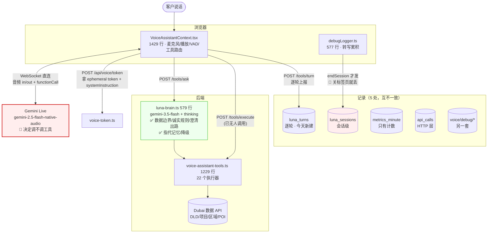

# Luna 系统现状 — 2026-08-10

盘点结果，不含改进方案。**结论：结构本身还行，烂在"决策权在最不可靠的那一层"和"观测/测试全在错的地方"。**

规模：**21 个端点 / 6 个 router / 6266 行**，其中单文件 1429 行（`VoiceAssistantContext.tsx`）、1229 行（`voice-assistant-tools.ts`）。

---

## 1. 数据流



**关键结构事实**：音频**不经过我们的服务器**。浏览器用 ephemeral token 直连 Gemini Live，后端只发 token + 执行工具。所以后端天然看不到"Luna 说了什么"，除非前端上报。

---

## 2. API 清单

### 在用

| 端点 | 谁调 | 作用 |
|---|---|---|
| `POST /api/voice/token` | 前端 | ephemeral token + **systemInstruction**（Live 层 prompt 的唯一出口） |
| `POST /api/voice/tools/ask` | 前端（Live functionCall 触发） | **两层架构的接缝** → Brain |
| `POST /api/voice/tools/ask-more` | 前端 | 两段式第二段（**已默认关闭**，`LUNA_TWO_STAGE=1` 才开） |
| `POST /api/voice/tools/turn` | 前端每轮 | 逐轮上报（今天新建） |
| `POST /api/events/voice-session` | 前端 `endSession` | 整场 transcript |
| `POST /api/voice/debug/session` | 前端 debugLogger | 另一套调试日志 |

### 死的 / 该删的

| 端点 / 文件 | 行数 | 状态 |
|---|---|---|
| `voice-chat.ts` + WebSocket `/api/voice-chat` | 162 | 前端从不连，**但 `index.ts:225` 仍在启动 WS server** |
| `voice-assistant.ts`（服务端 Live 实现） | 463 | 只被 `voice-chat.ts` 引用 = 整块死代码 |
| `POST /api/voice/tools/execute` | — | 拆层后无人调用（Brain 直接 `executeTool()`） |
| `/api/voice/text` | — | **端点根本不存在**，前端两处注释还在提它 |
| `voice-debug.ts` 的 4 个端点 | 317 | 与 `luna_sessions` 重复记录 |

**≈625 行纯死代码，还占着一个 WebSocket server。**

### 另一条产品线（不混淆）

`voice-rtc.ts` 7 个端点 = Agora 实时带看通话，与 Luna 对话无关。

---

## 3. 三个真正的问题

### 🔴 A. 决策权在最不可靠的那一层

所有护栏都在 Brain：数据边界、诚实规则、澄清出路、指代记忆、降级。
**但"要不要问 Brain"是 Live 模型自己决定的。**

它不问的时候：护栏 100% 失效，且**后端不知道这一轮存在过**。

已实测两次这类失败：
- 让它「先说 filler 再调工具」→ 说完就结束回合，**一次工具都不调**
- 两段式 `pending` → 一半的对话不调 `ask_luna_more`（`start=8 / resume=4`），客户听到「好，我看一下」然后永远沉默
- owner 报的「AI 说能卖二手房」——同样的问题直接问 Brain，三种问法答案全对

结论：**2.5 native audio "说完一句话之后还会不会调工具"是不可靠的**，不能把任何"失败即挂断"的机制建在它自觉上。

### 🔴 B. 观测断层：延迟数据只进 console，不落库

前端**已经算好了**关键时间戳（`VoiceAssistantContext.tsx:705-712`）：

```
[VoiceTiming] Luna reply START (text) — {X}ms after user STOPPED, {Y}ms after user STARTED
```

**只有 `console.log`。** 所以「客户说话到 AI 回话隔多久」这个问题，
线上一条数据都没有，只能在自己浏览器 DevTools 里看。

其余记录也各缺一块：

| 存储 | 有什么 | 缺什么 |
|---|---|---|
| `luna_sessions` | 整场 transcript | 只在 `endSession` 写 → **实测 12 小时 0 行**，人明明用过 |
| `luna_turns` | 逐轮 + 是否问过 Brain | 无延迟分解（刚建） |
| `metrics_minute` | 计数 | 无内容，查不到"说了什么" |
| `api_calls` | HTTP 耗时 | 分不清是 Brain 慢还是排队 |

### 🔴 C. 测试断层：三套跑分，全测后端，测不到 Live

| 跑分 | 测什么 | 盲区 |
|---|---|---|
| `luna-eval.ts` | 工具返回是否说真话 | 不涉及模型 |
| `luna-brain-eval.ts` | Brain 答得对不对 | **测不到 Live 有没有问 Brain** |
| `luna-eval-live.ts` | Live + 真 prompt + 真工具 | **文字注入 ≠ 真实前端**：不走 `VoiceAssistantContext`，不走麦克风/VAD/播放，工具声明是脚本内联的第二份 |

三套**全是 CLI**，只有开发者能跑，结果不落库、admin 看不到。

「二手房」和「等一分钟才开口」两个真实故障，**三套跑分一个都抓不到** ——
因为它们都发生在"Live 决定不问 Brain"这条路径上，而没有任何测试走真实前端链路。

---

## 4. Admin 现状

| 现有 | 位置 | 能力 |
|---|---|---|
| Luna 统计卡 | `AdminAnalytics.tsx:348-356` | 会话数、平均时长、平均轮数、工具调用总数 |
| 会话回看 | `SessionViewer.tsx`（**129 行**） | transcript + 工具调用列表 + 耗时 |

**没有的**：每轮延迟分解 · "这轮有没有问 Brain" · 测试入口 · 测试结果页 · AI 评估 · 重放。

---

## 5. 设计细节（改之前必须知道）

1. **音频不经后端** —— 浏览器直连 Gemini。后端看不到对话，除非前端上报。任何"服务端拦截 Luna 说的话"的方案都不成立。
2. **Live 层 prompt 的唯一出口是 `/api/voice/token` 的 `systemInstruction`** —— 改 prompt 不用发前端。
3. **工具声明有两份**：前端 `voiceTools`（3 个：`ask_luna` / `ask_luna_more` / `capture_contact`）+ 跑分脚本内联一份。后端 22 个执行器现在**只有 Brain 看得见**。`frontend/scripts/check-voice-tools.mjs` 守着它们不漂移。
4. **`sendClientContent` 可以从前端主动向 Live 注入内容** —— 文字模式就是这么做的（`VoiceAssistantContext.tsx:489`）。这是唯一一条"不依赖 Live 自觉"的通道。
5. **计费按时长**，音频输出单价是文本的 6 倍；token 用量只有浏览器看得见（`reportLiveUsage`）。
6. 会话上报靠 `endSession`，`pagehide` 兜底，**都可能丢**；逐轮 + `keepalive` 才可靠。
