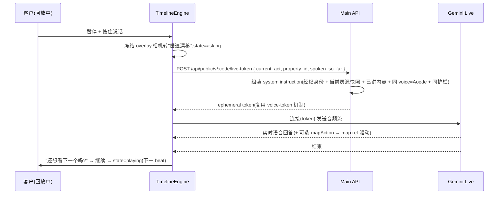

# Luna Tour — 体验设计 Spec(让客户尖叫的那 3 分钟)

> 版本:v2 · 2026-05-30
> 定位:本文是**体验驱动**的设计 spec。它先把"客户点开链接的那一刻"逐秒分镜设计透彻,再倒推技术契约。
> 与 `docs/agent-demo-saas-spec.md`(数据/架构基线 v1)、`docs/reports/2026-05-30-tour-ux-config-audio-tradeoffs.md`(音频/配置取舍)、`docs/reports/2026-05-30-implementation-readiness.md`(就绪度)配套。
> 北极星:**异步分享,客户独自点开,前 10 秒就被震撼,3 分钟看完三个家,忍不住想联系经纪。**

---

## 0. 设计哲学 / 北极星

**一句话:把"看房链接"变成一部为你私人定制的微电影。**

不是网页,是**体验**。客户在 WhatsApp 点开一个链接,得到的不是房源列表,而是:

- 一个叫得出他名字的开场
- 电影级的城市俯冲运镜
- 一个温柔、专业、永远在线的 AI 顾问 Luna 的讲解
- 数据像故事一样"涌现"——不是静态数字,是会增长、会描绘、会发光的可视化
- 随时能按住说话插嘴提问,Luna 用同一个声音实时回答(分不出哪句是录的、哪句是活的)
- 一个让他心动、然后一键找到经纪的结尾

**三条铁律:**
1. **零等待** — 进来就动,永不转圈。第一帧必须在 1 秒内出现。
2. **永远在动** — 地图、声音、数据三条轨道始终有一条在动,绝不静止冷场。
3. **像真人,不像软件** — 没有按钮森林、没有 loading、没有"抱歉/无法";一个有人格的 Luna 带着你逛。

**衡量标准(体验 KPI):**
- 首帧 < 1s,首次运镜 < 2s
- tour_complete(完看率)> 60%
- 平均插嘴提问 ≥ 1 次/会话
- CTA 点击(WhatsApp/电话)> 25%
- 截图/转发率(社交传播信号)—— 它得好看到让人想截图

---

## 1. 客户体验:逐秒分镜(The Reveal)

> 全程**竖屏、全屏、手机优先**(WhatsApp 打开即手机)。横屏与桌面是自适应降级,不是主场景。
> 声音设计贯穿:whoosh(运镜)、tick(UI)、subtle ambient(底噪)、haptic(关键节点震动)。

### 1.0 打开前 —— WhatsApp 链接预览卡(被点击之前就赢一半)

经纪粘贴链接时,WhatsApp/iMessage 抓取的 `og:image` **不是 logo**,而是为这条 session 动态生成的卡片:

```
┌───────────────────────────────┐
│  [最美一套房的夜景大图]          │
│                               │
│   为 Sarah 私人定制 ✨          │
│   David 精选的 3 个家           │
│   ▶ 3 分钟 · 语音导览           │
│   [David 头像]  [Luna 光点]     │
└───────────────────────────────┘
```

- 标题带**客户真名**("为 Sarah 定制")。
- `og:title` = `David 为你精选了 3 个家 · Luna 带你看`
- 动态 OG 图后端生成(satori/资源拼合),用 session 里第一套房的最佳图 + 客户名。
- 目标:在点开**之前**就制造"这是给我一个人的"独占感。

### 1.1 开场 0–10s —— The Reveal(最重要的 10 秒)

| 时间 | 画面 | 声音 | 触觉 |
|---|---|---|---|
| 0.0s | 全屏深色,一个呼吸的光点(Luna)在中央 | 轻 ambient 渐入 | 轻震一下 |
| 0.5s | 经纪头像 + "David Chen · Emaar 认证顾问"淡入 | — | — |
| 1.5s | 大字:**"为 Sarah 私人定制"**(客户名) | — | — |
| 2.5s | 地球/高空视角的迪拜,镜头开始**俯冲**(pitch 拉起、zoom 推进) | whoosh | — |
| 3.5s | 俯冲穿过云层,天际线浮现(3D 建筑倾斜) | Luna 开口:"Sarah 你好,我是 David 的助手 Luna。" | — |
| 6.0s | 相机平移,锁定第一片区域 | "接下来三分钟,我带你看三个,我觉得最适合你的家。" | — |
| 9.0s | 底部浮现 3 个进度圆点(○ ○ ○),第一个点亮 | tick | 轻震 |

**关键:** 这 10 秒是预生成的(音频 + camera path 都已烘焙),首帧地图用静态截图/低清瓦片秒出,真 3D 在后台加载,**客户感知零等待**。

### 1.2 每套房 —— 三幕式 Movement(Act)

每套房是一个 **Act**,由三个 **Beat** 组成,地图运镜 / 旁白 / 数据动画三轨严格同步。

#### Beat 1 · 抵达(Arrival)~8s
- 相机:从上一处**平滑飞行**到本楼盘,到达后**缓慢环绕**(orbit:bearing 360° 慢转 + 轻 pitch),楼盘在画面中心。
- 浮层:楼盘名 + 价格大字从底部升起;开发商 logo 角标。
- 旁白:"第一个家,在 Dubai Marina,就在海边。"
- 数据:无,先给情绪和空间感。

#### Beat 2 · 生活(Life)~12s
- 相机:轻微拉远,俯角看周边。
- 数据涌现(逐个动画,不是一次性):
  - **距离线**像激光一样**描绘**出来 → 末端 pin 弹出:"🚇 地铁 600m"、"🏖 海滩 200m"、"🎓 GEMS 5 分钟"
  - **设施辐射图**(amenity_spokes)一根根弹出,中心分数滚动到 "便利度 92 · 优秀"
- 旁白:"走 3 分钟到海滩,孩子上学 5 分钟,生活很方便。"

#### Beat 3 · 数字(Numbers)~10s
- 相机:拉远,虚化地图,**ROI 卡片飞入**占据下半屏。
- 数据戏剧化:
  - 买入价数字 **count-up**:0 → AED 2,800,000
  - 一条进度条**绿色填充**,数字滚动到 5 年后:→ AED 4,100,000
  - 涨幅 "+46%" 高亮脉冲
  - (可选)付款计划时间轴横向展开
- 旁白:"280 万买入,租金加升值,5 年后大约 410 万。"

> 三套房 = 三个 Act,中间用一次"飞越城市"的转场连接(相机拉高掠过,whoosh),进度圆点推进。

### 1.3 暂停 + 插嘴提问(切 Live)—— 体验高光

**触发:** 任何时候,客户点屏幕任意处 / 按住底部 Luna 光点。

| 步骤 | 表现 |
|---|---|
| 暂停 | 旁白停;画面**不死**——地图缓速漂移、Luna 光点放大呼吸;字幕:"想问什么?按住说话" |
| 提问 | 客户按住光点说话(或打字)→ 无缝切到 Gemini Live |
| 回答 | Luna 用**完全相同的声音(Aoede)**实时回答;若问题涉及位置/数据,**实时驱动地图**(复用现有 voice tools);Live 已被注入上下文:"客户正在看 Marina 这套" |
| 回流 | 回答完:"还想看下一个吗?" → 客户点继续 → 回到回放的下一个 Beat |

**无缝感是命门:** 预生成旁白和 Live 用**同一个 voice**,客户分不出"录的"和"活的",感觉 Luna 是一个真实、随时在场的人。

### 1.4 结尾 —— The Close(情感钩子 + 一键成交)

| 时间 | 画面 | 旁白 |
|---|---|---|
| — | 相机拉到全城高空,三套房的 pin **同时点亮**呼吸 | "这就是我为你选的三个家。" |
| — | 三套房缩略图横排卡片浮现,每张可点 ❤️ | "最喜欢哪个?点个心告诉 David。" |
| — | 客户点 ❤️ → 卡片高亮 + 轻震(反馈回流 client_feedback) | — |
| — | 大 CTA:David 头像 + **"和 David 聊聊"** 按钮 | "想亲眼看看?David 在等你。" |

CTA 点击 → 一键 WhatsApp,**预填消息**:
> "David 你好,我看完了 Luna 的导览,我最喜欢 Marina 那套,想约时间看房。"

### 1.5 微交互 & 感官细节(让它"性感")

- **排版:** 大字、极简、留白;关键数字用霓虹高亮;可选字幕轨(无障碍 + 静音可看)。
- **配色:** 深色沉浸底,地图夜景风格,数据用品牌色/霓虹。
- **运镜:** 60fps,所有相机移动用 ease-in-out;俯冲/环绕用 pitch+bearing 制造 3D 电影感。
- **声音:** whoosh(运镜)、tick(UI)、ambient(底噪)、Luna 人声;客户可一键静音(切字幕模式)。
- **触觉:** 开场、进度推进、点 ❤️、CTA —— 关键节点 `navigator.vibrate`。
- **进度:** 顶部发丝细线 + 底部 3 圆点;可点圆点跳房。
- **永不转圈:** 任何加载都用骨架/预览图兜底,绝不出现 spinner。

---

## 2. 体验支柱(设计决策的试金石)

任何新需求,先过这 6 条;不服务它们的,砍。

1. **The Reveal** — 个性化开场 + 城市俯冲,前 10 秒定生死。
2. **活的地图** — 电影级相机(俯冲/环绕/掠过),不是生硬跳转。
3. **数据会讲故事** — 数字 count-up、距离线描绘、热力扩散、辐射弹出;静态数字是失败。
4. **同一个 Luna** — 预生成讲解与 Live 问答同声同人格,无缝切换。
5. **零等待 / 永远在动** — 三轨永远有一条在动,首帧 < 1s。
6. **心动即成交** — 结尾情感钩子 + 一键预填 WhatsApp,把感动转成动作。

---

## 3. 经纪侧:一键出片(创作体验也要爽)

经纪的体验目标:**3 分钟做出一部微电影,不需要懂任何配置。**

### 3.1 创作流程(简化到极致)

```
① 选客户(或现场建档)
   └ 档案已有:预算/目标/国籍/家庭/偏好区域
② 选 2–3 套房(从现有项目库,支持 AI 推荐 Top 候选)
③ (可选)说一句话:"香港投资客,重投资回报,专业,3 分钟"
④ 点【生成导览】
   └ AI 起草:配置 + 旁白 + 运镜 + 数据选择(后台三层配置自动合并)
⑤ 故事板预览:像看片一样过一遍,可改字 / 重排 / 重生成某幕 / 换语气
⑥ 发布 → 动态 OG 卡 + 链接 + 一键 WhatsApp 发给客户
```

- **AI 代配是默认**:经纪不碰 JSON。三层配置(平台默认 → 经纪行护栏 → AI 按客户档案填)在后台完成(详见 §5)。
- **审核可选**:默认 `auto_publish`;经纪行可对高客单价房强制 `review_required`。
- **故事板编辑器**:左=幕/Beat 列表,中=旁白文本 + 语气微调,右=该 Beat 的运镜+数据**实时预览**。改一句可只重生成这一段音频。

### 3.2 经纪 Dashboard(其余)
- 客户 CRM(pipeline 阶段、lead_score 排序)
- 我的导览(草稿/已发布/归档,各自的完看率/插嘴数/CTA)
- **"客户正在看" 实时提醒** → 趁热打电话
- 模板库(经纪行官方模板,品牌+合规一致)
- 订阅与配额

---

## 4. 技术契约:怎么实现这个体验

> 这一章是给"开始写代码"准备的。重点补齐 v1 spec 没写的三块高风险缺口:**电影级 TourScript、AI 生成契约、回放引擎 + 地图命令式接口、切 Live 协议**。

### 4.1 TourScript v2 数据结构(支持电影运镜)

相比 v1,核心升级:`map_actions` 从"单点 fly_to"升级为**支持相机关键帧(camera path)**,以实现俯冲/环绕/掠过;新增 `overlay` 轨(数据动画)与 `transition`(转场)。

```jsonc
{
  "version": 2,
  "voice": "Aoede",
  "language": "zh",
  "total_ms": 178000,
  "theme": { "map_style": "dark", "accent": "#00E0B8", "captions": true },
  "intro": {
    "id": "reveal",
    "narration": "Sarah 你好,我是 David 的助手 Luna…",
    "audio_url": "r2://tours/{session}/zh/reveal.mp3",  // 预生成;空则浏览器 TTS 兜底
    "duration_ms": 10000,
    "camera": [                                          // 相机关键帧序列
      { "at_ms": 2500, "center": [55.27,25.20], "zoom": 4,  "pitch": 0,  "bearing": 0,   "duration_ms": 3500, "easing": "easeInOut" },
      { "at_ms": 6000, "center": [55.14,25.08], "zoom": 12, "pitch": 55, "bearing": -20, "duration_ms": 3000, "easing": "easeInOut" }
    ],
    "overlays": [
      { "at_ms": 1500, "type": "title", "text": "为 Sarah 私人定制", "duration_ms": 2000 },
      { "at_ms": 9000, "type": "progress_dots", "total": 3, "active": 0 }
    ]
  },
  "acts": [
    {
      "id": "act-1",
      "property_id": "uuid-...",
      "beats": [
        {
          "id": "arrival",
          "narration": "第一个家,在 Dubai Marina,就在海边。",
          "audio_url": "r2://tours/{session}/zh/a1-arrival.mp3",
          "duration_ms": 8000,
          "camera": [
            { "at_ms": 0,    "center": [55.14,25.07], "zoom": 15, "pitch": 60, "bearing": 0,   "duration_ms": 2500, "easing": "easeOut" },
            { "at_ms": 2500, "type": "orbit", "center": [55.14,25.07], "degrees": 320, "duration_ms": 5500 }   // 环绕
          ],
          "overlays": [
            { "at_ms": 1000, "type": "property_card", "fields": ["name","price","developer"] }
          ]
        },
        {
          "id": "life",
          "narration": "走 3 分钟到海滩,孩子上学 5 分钟。",
          "audio_url": "...a1-life.mp3",
          "duration_ms": 12000,
          "camera": [ { "at_ms": 0, "center": [55.14,25.07], "zoom": 14, "pitch": 45, "duration_ms": 1500 } ],
          "overlays": [
            { "at_ms": 1500, "type": "distance_line", "to": [55.145,25.072], "label": "🚇 地铁 600m", "anim": "draw" },
            { "at_ms": 4000, "type": "distance_line", "to": [55.138,25.069], "label": "🏖 海滩 200m", "anim": "draw" },
            { "at_ms": 6500, "type": "amenity_spokes", "center": [55.14,25.07], "score": 92, "tier": "优秀", "anim": "pop" }
          ]
        },
        {
          "id": "numbers",
          "narration": "280 万买入,5 年后大约 410 万。",
          "audio_url": "...a1-numbers.mp3",
          "duration_ms": 10000,
          "camera": [ { "at_ms": 0, "zoom": 13, "pitch": 0, "duration_ms": 1500 } ],
          "overlays": [
            { "at_ms": 1500, "type": "roi_card", "anim": "countup",
              "data": { "buy": 2800000, "future": 4100000, "years": 5, "growth_pct": 46,
                        "yield_pct": 6.2, "payment_plan_ref": true } }
          ]
        }
      ],
      "transition_out": { "type": "flyover", "duration_ms": 2500, "narration": null }
    }
    // act-2, act-3 …
  ],
  "outro": {
    "id": "close",
    "narration": "这就是我为你选的三个家。最喜欢哪个?",
    "audio_url": "...close.mp3",
    "duration_ms": 9000,
    "camera": [ { "at_ms": 0, "zoom": 11, "pitch": 30, "duration_ms": 3000 } ],
    "overlays": [
      { "at_ms": 1000, "type": "highlight_all_pins", "property_ids": ["...","...","..."] },
      { "at_ms": 3000, "type": "favorite_picker", "property_ids": ["...","...","..."] },
      { "at_ms": 5000, "type": "cta", "agent": "{{agent}}", "channel": "whatsapp",
        "prefill": "David 你好,我看完了 Luna 的导览,想约看房。" }
    ]
  }
}
```

**Overlay 类型表(回放引擎需实现的动画原语):**

| type | 动画 | 数据源 |
|---|---|---|
| `title` | 淡入大字 | 客户名/文本 |
| `progress_dots` | 进度圆点 | acts 数 |
| `property_card` | 底部升起 | session_properties.snapshot |
| `distance_line` | 激光描绘 + pin 弹标签 | measure_distance(现有 tool) |
| `amenity_spokes` | 辐射逐根弹出 + 分数滚动 | analyze_area_amenities(现有 tool) |
| `roi_card` | 数字 count-up + 进度条填充 | investment-calculator(现有纯函数) |
| `highlight_all_pins` | 多 pin 同时呼吸 | highlight_projects(现有 tool) |
| `favorite_picker` | 卡片横排 + ❤️ | client_feedback 写入 |
| `cta` | 经纪卡 + WhatsApp 预填 | agents.brand |

### 4.2 AI 生成契约(产品心脏 —— 这块最该先验证)

**目标:** 给定客户档案 + 房源数据 + 生效配置,LLM 输出一份**合法、可回放**的 TourScript v2。

**输入(喂给 LLM 的 context):**
```jsonc
{
  "client": { "name","goal","budget","family","nationality","preferred_areas" },
  "config": { /* §5 生效配置:语气/叙事权重/节奏/地图编舞/谈点/护栏/语言 */ },
  "properties": [   // 每套房预先算好的事实,LLM 不许编
    {
      "id","name","developer","area","coords":[lng,lat],"price",
      "unit": { "bedrooms","size_sqft","price_per_sqft" },
      "investment": { /* investment-calculator 输出:buy/future/growth/yield/payback */ },
      "distances": [ { "label":"地铁","meters":600,"to":[lng,lat] }, ... ],  // 预算
      "amenity": { "score":92,"tier":"优秀","spokes":[...] },                // 预算
      "payment_plan": { ... },
      "agent_pitch": "开发商最后一期"
    }
  ],
  "constraints": {
    "target_seconds": 180,
    "beats_per_property": ["arrival","life","numbers"],
    "allowed_overlay_types": ["title","distance_line","amenity_spokes","roi_card", ...],
    "allowed_camera": ["flyTo","orbit","flyover"],
    "banned_phrases": ["抱歉","对不起","无法"],
    "guardrails": ["no_guaranteed_returns","no_political_speculation"]
  }
}
```

**输出约束(关键,防 LLM 跑飞):**
- 用**结构化输出 / JSON schema 强约束**,LLM 只能产出 TourScript v2 的合法字段。
- **坐标、价格、距离、ROI 全部来自输入的 `properties`,LLM 只能引用不能生成**(防幻觉编数据)。LLM 只负责:写旁白文字、选用哪些 overlay、排时间轴 `at_ms`、配相机动作。
- 旁白受 `narrative_focus` 权重与 `banned_phrases`/`guardrails` 约束。
- 生成后**程序化校验**:每个 `audio`/`overlay`/`camera` 的 `at_ms + duration_ms` 不超出 beat 时长;引用的 property_id/坐标在输入集内;总时长 ≈ target_seconds(±15%)。校验失败→自动重试一次→仍失败标记人工。

**模型:** 文本脚本用 `gemini-3-flash`(快、便宜)或 `gemini-3.1-pro`(质量优先);先做可切换。

**这是第一个该做垂直切片验证的点。** 写死 1 客户 + 2 房,跑通"输入→TourScript JSON→校验通过",肉眼审旁白质量和时间轴合理性,再谈其他。

### 4.3 电影级回放引擎(前端)

一个 **TimelineEngine**:单一时钟,驱动三条轨道。

```
TimelineEngine
 ├─ clock (requestAnimationFrame, 支持 play/pause/seek/rate)
 ├─ AudioTrack   → 按段播放预生成 mp3(AudioPlayer 复用) / 兜底浏览器 TTS
 ├─ CameraTrack  → 调 map.executeCamera(keyframe)  (§4.4)
 └─ OverlayTrack → 挂载/卸载 React overlay 组件 + 驱动其入场动画
```

- **状态机:** `loading → reveal → playing(act/beat) → paused → asking(Live) → playing → outro → ended`
- **pause:** 停 audio、冻结 overlay,但相机进入"缓速漂移"保持画面活;进入 `asking` 走 §4.6。
- **seek/跳房:** 点进度圆点 → 跳到对应 act 的首 beat,相机直接 flyTo,音频从该段起。
- **预加载:** 当前 beat 播放时,预取下一 beat 的音频与 overlay 数据;首屏用静态地图截图兜底。
- **降级:** 低端机/弱网 → 关 3D pitch、降 fps、关 ambient,但流程不变。

### 4.4 地图命令式接口改造(必做前置)

现状:`MapViewMapLibre.tsx` 是 props 响应式,**无 ref**。回放引擎需要逐帧命令式驱动。

**改造:** 用 `useImperativeHandle` 暴露 ref API(底层调用 MapLibre `map` 实例与现有 mapAction 渲染逻辑):

```typescript
export interface MapTourHandle {
  // 相机
  flyTo(opts: { center:[number,number], zoom?:number, pitch?:number, bearing?:number,
                duration?:number, easing?:Easing }): Promise<void>
  orbit(opts: { center:[number,number], degrees:number, duration:number }): Promise<void>
  flyover(opts: { from:[number,number], to:[number,number], duration:number }): Promise<void>
  // 数据 overlay(复用现有 mapAction 渲染)
  drawDistanceLine(opts: { from:[number,number], to:[number,number], label:string, anim:'draw' }): void
  showAmenitySpokes(opts: { center:[number,number], spokes:Spoke[], score:number, tier:string }): void
  highlightPins(ids: string[]): void
  setHeatmap(metric: AreaMetric | 'none'): void      // ← 新增,v1 缺失
  clearOverlays(): void
  // 控制
  setStyle(style: 'dark'|'default'): void
}
```

- 现有的 props 驱动**保留**(消费者端语音助手还在用);新增 ref 是叠加,不破坏现状。
- `set_heatmap` 同时补一个 voice tool(给 Live 提问时用)。
- `orbit`/`flyover` 用 MapLibre `easeTo`/`flyTo` + 自定义 rAF 插值实现。

### 4.5 音频策略(预生成为主 + 浏览器 TTS 兜底 + R2)

**默认:预生成。** 经纪发布时,后台 Worker 为每个 beat 生成 mp3 存 R2,回放走 CDN——便宜、可暂停、可快退、合规可审。

**新建子系统(v1 缺失):**
- TTS:用 Gemini TTS(非 Live 的合成端点)或同等服务,把每段旁白合成 mp3。**voice 必须与 Live 的 voice 一致(Aoede)**,保证切 Live 无缝。
- 存储:R2 上传(项目当前无 R2 代码,需新建 client + 签名 URL)。
- `tour_scripts.script.*.audio_url` 写 R2 路径。

**兜底:** 音频未就绪(刚发布/生成失败)→ 客户端浏览器 `speechSynthesis` 即时朗读,体验不中断,高质量音频后台补齐后下次访问替换。

**MVP 阶段:** 可先全程浏览器 TTS 兜底跑通体验,R2 预生成作为 Phase 之后接入(垂直切片不被音频管线阻塞)。

### 4.6 提问切 Live 的无缝交接协议(v1 缺失)



**关键点:**
- 复用现有 `/api/voice/token` + `voice-tools.ts` 全套,只需把 system instruction **参数化**:`buildSystemInstruction({ role:'tour-luna', agent, propertySnapshot, spokenSoFar })`。
- **同 voice (Aoede)** 是无缝感的命门。
- Live 拿到"当前在看哪套 + 已讲什么",避免重复或答非所问。
- Live 用量计入 `usage_counters.live_minutes`(成本控制)。

### 4.7 性能与"零等待"工程

- 首帧:静态地图截图(发布时烘焙一张)秒显,真 3D 后台 warm-up。
- 资源:OG 卡、首屏图、第一段音频随 `/api/public/v/:code` 首响应一起给(或并行预取)。
- 运镜:相机插值上限 60fps;低端机自动降级关 pitch。
- 永不 spinner:一切用骨架屏 / 预览图。

---

## 5. AI 代配(一句话 → 生效配置)

经纪不碰 JSON。生效配置 = **三层后台合并**:

```
平台默认基线  →  经纪行护栏(强制,is_locked,合规/品牌)  →  AI 起草层(按客户档案 + 一句话)
```

- **AI 起草层**:输入 = 客户档案(goal/budget/family/nationality) + 经纪一句话(可选) → 输出 = config 片段(语气、narrative_focus 权重、target_seconds、map_choreography、talking_points)。用结构化输出约束到 §2.2 的 schema。
- 例:档案是"投资客 + 香港" + 一句"重租金回报,专业,3分钟" → AI 产出 `{tone:professional, languages:[zh,en], narrative_focus:{investment:0.5,value:0.2,...}, pacing:{target_seconds:180}, map_choreography:{heatmap_metric:rentalYield,...}}`。
- 经纪行护栏**永远覆盖** AI(如禁词、不承诺回报、品牌色),保证合规底线不被一句话绕过。
- 结果存 `demo_sessions.effective_config` 快照,保证可复现。

---

## 6. 数据模型增量(在 v1 schema 之上)

v1 的表(agents/clients/demo_configs/demo_sessions/session_properties/tour_scripts/engagement_events/client_feedback/subscriptions/usage_counters)基本够用,**针对 v2 体验补充:**

- `demo_sessions`:加 `og_image_url`(动态 OG 卡)、`reveal_snapshot_url`(首帧静态地图)、`theme jsonb`。
- `tour_scripts.script`:升级为 TourScript **v2** 结构(§4.1);保留 `version` 字段以兼容。
- `session_properties.snapshot`:确保预存 `distances[]` / `amenity{}` / `investment{}`(供回放 overlay 直接用,客户端零计算)。
- `audio_assets`(新,可选):`{session_id, beat_id, language, voice, r2_url, status}` —— 跟踪预生成音频状态(便于兜底切换)。
- 其余沿用 v1。

---

## 7. 落地阶段(垂直切片优先,验证心脏后再铺开)

> 原则:先证明"AI 能排出像样的电影脚本 + 前端能放出震撼回放",再做 CRUD/订阅/预生成音频等确定性工作。

- **Phase 0 — 心脏切片(证明体验可行)**
  - 写死 1 客户 + 2 套房(从现有 residential_projects 取真数据 + investment-calculator 算 ROI)。
  - 实现 §4.2 AI 生成 → TourScript v2 + 程序化校验。
  - 实现 §4.4 地图命令式 ref(flyTo/orbit/drawDistanceLine/showAmenitySpokes)。
  - 实现 §4.3 TimelineEngine 最小版 + §1 的 Reveal/三幕/Close 分镜;音频先用浏览器 TTS 兜底。
  - **验收:** 真机点开一个写死链接,能看到 §1 描述的震撼 3 分钟。这是 go/no-go。

- **Phase 1 — 切 Live + 数据层**
  - §4.6 提问切 Live(system instruction 参数化,同 voice)。
  - 建 agents/clients/demo_sessions 等表 + RLS + 公开只读 `/v/:code`。

- **Phase 2 — 创作闭环**
  - 经纪 §3 一键出片:选客户+选房+一句话 → AI 代配(§5) → 故事板预览 → 发布。
  - 动态 OG 卡 + 首帧烘焙 + WhatsApp 分享。

- **Phase 3 — 预生成音频 + 遥测 + 跟进**
  - §4.5 Gemini TTS + R2 预生成链路。
  - engagement 遥测 + lead_score + "正在看"提醒 + ❤️ 反馈回流。

- **Phase 4 — 放大**
  - 订阅/配额(Stripe)、多语言、经纪行模板/白标、看房预约。

---

## 8. 风险与对策

| 风险 | 对策 |
|---|---|
| **AI 排不出像样的电影脚本**(最大风险) | Phase 0 先验证;结构化输出 + 程序化校验 + 数据只引用不生成;Beat 模板固定(arrival/life/numbers)降低自由度 |
| 电影运镜在低端手机卡顿 | 自动降级(关 pitch/降 fps/关 ambient);首帧静态图兜底 |
| 预生成音频管线复杂、被低估 | MVP 用浏览器 TTS 兜底先跑通;R2+Gemini TTS 放 Phase 3;voice 统一 Aoede |
| 切 Live 不无缝(声音/上下文断层) | 同 voice + 注入当前房源&已讲内容;暂停时画面保持"活" |
| 合规(承诺回报/政治) | 经纪行护栏覆盖 AI;数据只引用不编;quap 快照带 data_as_of |
| Live 成本 | 预生成为主,Live 仅提问;计入 usage_counters,按 plan 限分钟 |

---

## 附:与现有资产的映射(已核实)

| v2 能力 | 复用现有 | 需新建 |
|---|---|---|
| 数据 overlay(距离线/辐射/高亮) | voice-assistant-tools.ts(measure_distance/amenity_spokes/highlight_projects) | overlay 动画层 |
| ROI 数据 | investment-calculator.ts(纯函数) | count-up 动画组件 |
| 切 Live 问答 | voice-token.ts / voice-tools.ts / voice-chat.ts / AudioPlayer | system instruction 参数化 |
| 地图 | MapViewMapLibre.tsx | 命令式 ref(§4.4) + set_heatmap |
| 房源/区域/成交数据 | residential_projects / dld_* / dubai_areas / dubai_pois | session 快照预算字段 |
| 认证 | Supabase JWT / middleware/auth.ts | agent 角色 + 公开只读路径 |
| 音频 | Gemini Live(实时) | 预生成 TTS + R2(Phase 3) |
| 电影脚本生成 | — | AI 生成契约(§4.2,核心新建) |
| 电影回放 | — | TimelineEngine(§4.3,核心新建) |
