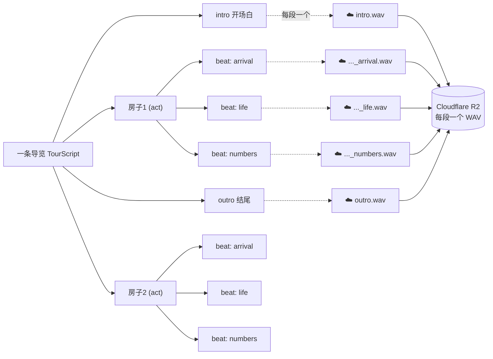
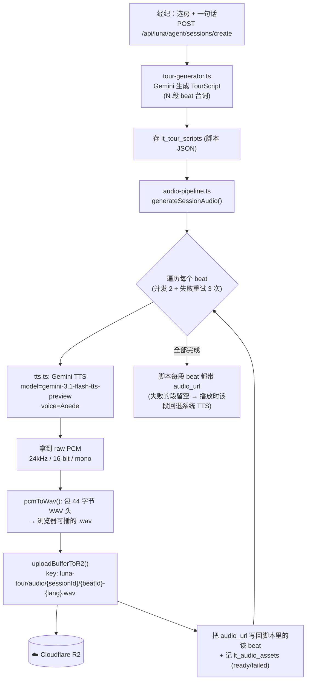
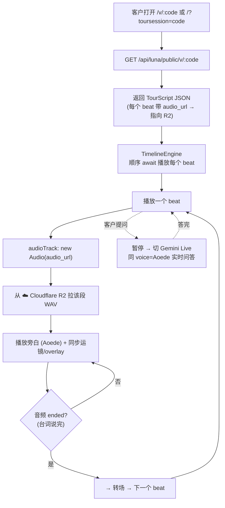
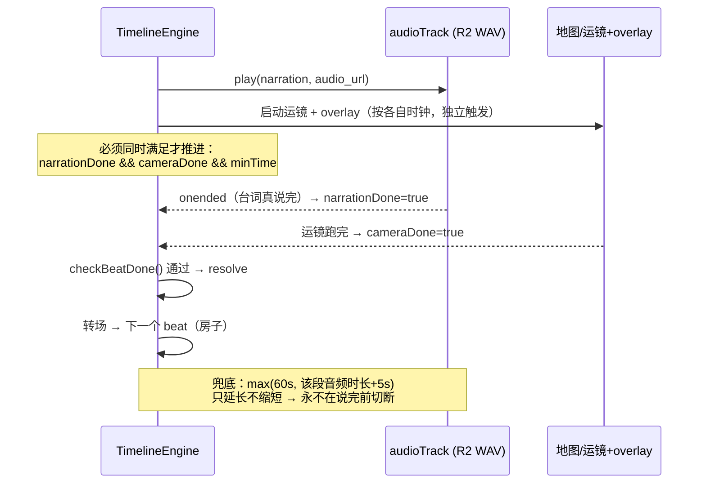

# Luna Tour 语音系统（现状）

> 更新：2026-06-02
> 一句话：**一条导览 = 很多段台词（beat）。每段台词在创建时用 Gemini TTS（voice=Aoede）预先合成一个 WAV 音频文件，存到 Cloudflare R2。客户观看时按段从 R2 拉取播放，「说完」才进行下一个动作/转场。客户提问时切 Gemini Live，用的是同一个 Aoede 声音。**

---

## 1. 核心概念：一条导览 → 多段台词 → 多个音频文件

一条导览脚本（TourScript）由顺序排列的 **beat（台词段）** 组成：开场 → 每个房子的 arrival/life/numbers → 结尾。**每个 beat 一段旁白，对应 R2 上的一个 WAV 文件。**

> demo 实例：3 个房子 → intro + 9 个 act beats + outro = **11 段台词 = R2 上 11 个 WAV 文件**。

---

## 2. 生成阶段（经纪创建导览时，一次性预录）

发生在经纪点「生成导览」时（`createSession`）。AI 先写出多段台词，再**逐段**合成语音并上传 Cloudflare。

**要点：**
- 语音是**预先生成**的（不是播放时实时生成），所以客户打开就能秒播、可暂停/快退、合规可控。
- 某段网络失败不阻塞建库；缺音频的单段在播放时回退浏览器 TTS（其余段仍是 Aoede）。

---

## 3. 播放阶段（客户观看，从 Cloudflare 拉取）

客户打开分享链接 → 公开端点返回脚本（每段带 `audio_url`）→ 引擎按段播放，**每段从 R2 拉 WAV**。

**「说完才转场」的保证**（结构性，非时间猜测）：

---

## 4. 关键事实表

| 项目 | 现状 |
|------|------|
| 主旁白声音 | **Gemini TTS，voice=Aoede**（与 Live 问答统一一种声音） |
| TTS 模型 | `gemini-3.1-flash-tts-preview`（可用 `LUNA_TTS_MODEL` 覆盖，有 fallback 链） |
| 音频格式 | 合成为 raw PCM 24kHz/16-bit/mono → 包成 **WAV** 供浏览器 `<audio>` 播放 |
| 一条导览的音频 | **每段台词（beat）一个 WAV 文件**；demo = 11 段 = 11 个文件 |
| 存哪 | **Cloudflare R2**，key=`luna-tour/audio/{sessionId}/{beatId}-{lang}.wav`，公网 `audio/wav` 可达 |
| 何时生成 | 经纪创建 session 时**一次性预录**（非播放时实时） |
| 状态跟踪 | `lt_audio_assets` 表（ready / failed），脚本里 `beat.audio_url` |
| 单段失败 | 该段回退浏览器系统 TTS，其余段仍 Aoede（不影响整体播放） |
| 转场时机 | 台词 `ended`（真说完）+ 运镜完成 + 最短停留 → 才进下一拍 |
| Live 问答 | 客户提问时暂停切 Gemini Live，同 voice=Aoede 无缝衔接 |

---

## 5. 相关代码（全部隔离在 `luna-tour/`，删目录即移除）

| 文件 | 职责 |
|------|------|
| `backend/src/luna-tour/tts.ts` | Gemini TTS → WAV Buffer（PCM 包头、模型 fallback） |
| `backend/src/luna-tour/audio-pipeline.ts` | 遍历 beats → 合成+上传 R2（重试/并发）→ 写回 audio_url + lt_audio_assets |
| `backend/src/luna-tour/regen-audio.ts` | CLI：给已有 session 补/重建音频 |
| `backend/src/services/r2-storage.ts` | `uploadBufferToR2()` 通用上传（复用现有 R2 客户端） |
| `backend/src/luna-tour/session-builder.ts` | createSession 后自动调用音频生成（失败不阻塞） |
| `backend/src/luna-tour/public-router.ts` | `GET /v/:code` 返回脚本（含 audio_url）+ live-token |
| `frontend/src/luna-tour/engine/audioTrack.ts` | 按段播放 audio_url（WAV），回传真实时长 |
| `frontend/src/luna-tour/engine/TimelineEngine.ts` | 顺序播放、事件驱动转场、音频感知兜底 |

> 给已有 session 补音频：`cd backend && npx ts-node src/luna-tour/regen-audio.ts <shareCode> [--force]`
