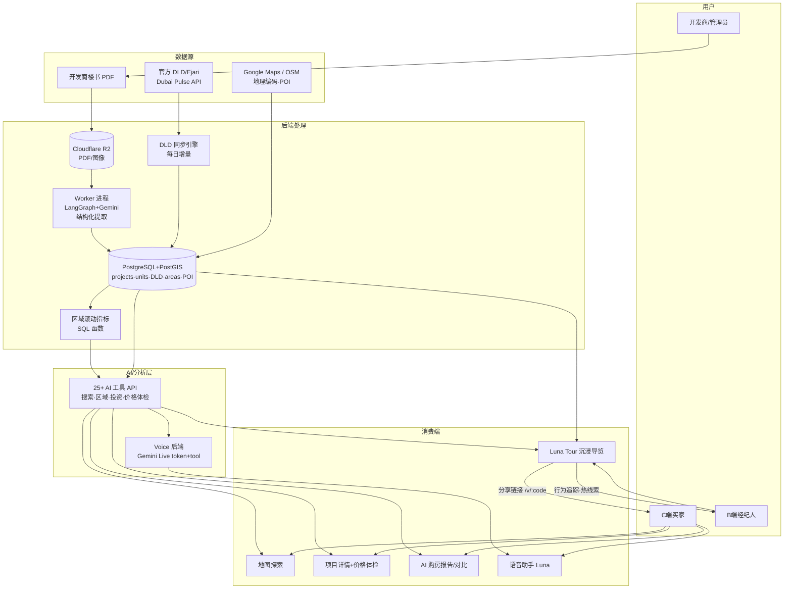

# Pinzos 系统评估与商业化分析

日期:2026-06-13
范围:全系统功能盘点 + 模块关系 + 产品/技术评价 + 赚钱可能性与路径

---

## 一、产品一句话定义

**Pinzos 是一个面向迪拜期房(off-plan)的 AI 房产平台**,用"官方成交数据 + 开发商楼书自动提取 + 地图/语音/沉浸式导览"三层,服务三类人:
- **C 端买家**(尤其海外/中文买家):地图探索、AI 投资报告、语音助手、项目对比
- **B 端经纪人**(增长引擎):一键生成带运镜+AI配音的沉浸导览(Luna Tour),分享给客户、追踪行为、筛选热线索
- **开发商/管理员**:上传楼书 → AI 自动提取结构化房产数据 → 审核发布

---

## 二、功能全景

### C 端(买家)
| 功能 | 页面 | 价值 |
|---|---|---|
| 交互地图 | `/map` MapLibre | 房产 pin + 5 种市场指标热力图(价格/租金收益/增长/成交量/单价)+ POI/地铁叠加 |
| 项目详情 | `/project/:id` | 概览/户型/付款计划/图库/**价格体检**(单价 vs 同区 DLD 中位数) |
| 区域洞察 | `/areas` | 成熟/增长/未来区分级,投资 vs 自住视角 |
| AI 购房报告 | `/report` | 问卷→推荐区域+5年三情景预测(保守/中性/乐观) |
| 项目对比 | `/compare` | 2-4 个项目 AI 对比 + 5 年投资预测 |
| 成交记录 | `/transactions` | DLD 真实成交查询、趋势、明细 |
| 语音助手 Luna | 全局 pill | Gemini Live 实时语音,25+ tool(搜索/飞行/区域分析/投资预测/可购力测算) |
| 收藏 | `/favorites` | 本地收藏+对比入口 |

### B 端(经纪人)— 核心差异化
| 功能 | 页面 | 价值 |
|---|---|---|
| 经纪台 | `/agent` | 导览表现指标 + 最热客户 |
| Luna Tour 生成 | `/agent/tour` | AI 一键生成 5-7 段故事线(开场→到达→生活→数据→结尾)+运镜+配音 |
| 时间线编辑器 | `/agent/tour/:id/edit` | NLE 风格,编辑镜头/旁白/卡片/ROI 图 |
| 分享会话 | `/v/:code` | 客户全屏沉浸看 demo,可暂停操作地图、点项目、留"喜欢"、点"联系经纪" |
| 可验证事实表 | `/factsheet/:code` | 带数据源引用、可打印 |
| 行为追踪 | telemetry | opens/completes/cta_clicks/loves → 热线索筛选 |

### 数据/管理后台
- 开发商上传(`/developer/upload`):多 PDF → R2 → worker(LangGraph 多 agent + Gemini)→ 结构化提取 → 审核提交
- 管理后台(`/admin/*`):项目/任务/区域/地标 GIS 编辑

### 数据底座(护城河所在)
- **官方 DLD 成交 + Ejari 租赁数据**(Dubai Pulse API 每日增量同步)→ `dld_transactions` / `dld_rent_contracts`
- 滚动指标 SQL 函数自动算区域中位价/租金收益/增长/成交量/信心度
- PostgreSQL + PostGIS 地理查询(区域 polygon 包含、POI bbox、最近设施距离)

---

## 三、模块关系图

**一句话读图**:两条数据进来(开发商楼书 + 官方成交数据)汇入一个 PostGIS 数据库,数据库之上长出 AI 分析层(投资/价格体检/区域),分析层同时喂给四个消费端(地图、详情、报告、语音)。经纪人用 Luna Tour 把这些包装成沉浸 demo 发给买家,买家行为回流成热线索 —— 这是 B 端闭环,也是变现的钩子。

---

## 四、系统评价

### 技术成熟度:高(已生产部署,非 demo)
- 双服务器架构(轻量 API cpx11 + 重负载 worker cpx32),职责清晰、抗故障、省钱
- 真在跑的能力:DLD 每日同步、PostGIS 地理查询、SSE 进度、worker 队列、Gemini Live 语音、MapLibre 高性能地图、中英双语、缓存与版本失效

### 真正的亮点(护城河候选)
1. **官方成交数据层**:接了 Dubai Pulse 官方 DLD/Ejari,价格体检("这套比同区中位贵 12%")、真实租金收益是**别人难快速复制的可信内容**,不是拍脑袋估的。
2. **Luna Tour**:AI 一键生成沉浸导览给远程客户 —— 这是 listing 门户(Bayut/Property Finder)没有的,切的是经纪人远程 close 海外买家的真痛点。
3. **语音 + 投资分析**:中文语音助手 + 5 年三情景预测,正好打中国买家(迪拜海外买家大头之一)。
4. **楼书自动提取**:刚做扎实的 PDF pipeline,把开发商 PDF 变结构化数据 —— 降低内容获取成本。

### 短板/风险
1. **投资预测的准确性是信任红线**:5 年预测若用简单复利((1+增长%)^5),买家一旦发现不准会反噬。需要明确"基于历史 DLD、非承诺",并持续用真实数据回测。
2. **C 端流量是最大未知数**:Bayut/Property Finder 垄断迪拜 C 端搜索流量。直接拼"找房门户"几乎必输。
3. **数据覆盖**:期房项目靠开发商上传,覆盖不全则地图显得空;需要主动采集或 BD 开发商。
4. **AI 成本**:Gemini 多模态提取 + 语音是按量大头(估 $200-500/月,随量线性涨)。
5. **收藏只存 localStorage**:换设备/清缓存即丢,且无法做用户级 lead 沉淀 —— 变现前需要账号级持久化。

---

## 五、能赚钱吗?怎么赚?

### 市场判断:有机会,但**不能走 C 端门户路线**
迪拜房产是全球最活跃的期房市场之一:海外买家多(中/俄/印)、单价高(一套期房常 150 万–千万 AED)、经纪佣金 2%(单套佣金 3 万–20 万+ AED)、经纪人数以万计且竞争激烈、开发商营销预算巨大。这意味着:**为"促成成交"付费的意愿在 B 端(经纪人、开发商)远高于 C 端买家。**

### 变现路径排序(推荐 → 备选)

**① B2B SaaS:卖给经纪人/经纪公司的 demo + 线索工具(最现实,首选)**
- 卖点:Luna Tour 让经纪人给海外客户做"远程沉浸看房",+ 行为追踪筛热线索,+ 投资报告/价格体检当专业背书。直接帮经纪人 close 单。
- 定价:个人经纪 ~$30-80/月;经纪公司团队版按席位 $200-1000+/月(白标、品牌、团队分析)。
- 为什么成立:一套期房佣金动辄 5 万+ AED,经纪人为"多 close 一单"付几百刀/月 ROI 极高;迪拜经纪人基数大。
- 这也正是项目既定方向(Luna Tour → B2B2C 经纪 demo)。

**② 开发商营销付费(强备选,客单价最高)**
- 卖点:期房靠"卖未来",开发商最缺的就是把图纸讲成体验。付费让项目优先展示 + 定制 Luna Tour + 投放给平台买家。
- 定价:按项目 listing 费 / 营销包(数千–数万 AED 一个项目)。
- 风险:需要先有一定 C 端/经纪人流量,开发商才肯付。

**③ 线索分成 / 佣金分成(想象空间最大,但最难)**
- 平台给经纪人导合格买家线索,成交后分佣(哪怕分 10%-20%,单套也是几千 AED)。
- 难点:需要真实 C 端流量 + 成交归因 + 合规。属于规模化后的上限,不是起步打法。

**④ 数据订阅(niche 补充)**
- 把 DLD 成交真相层(价格体检、区域指标)做成给小投资者/小中介的订阅。客单低,作为辅助现金流。

**⑤ C 端订阅(最弱,不建议作为主线)**
- 买家对"看房工具"付费意愿低,且要先打赢流量战。

### 务实的起步打法(我的建议)
1. **聚焦 B 端经纪人**,把 Luna Tour + 热线索追踪做成"经纪人离不开的远程成交工具",按月订阅。先验证:**有没有经纪人愿意为它每月付费 + 真的因此 close 了单**(这就是 memory 里的 "Phase 0 验证心脏")。
2. 用免费的 C 端体验(地图/语音/报告)做**获客和给经纪人 demo 的素材**,不指望 C 端直接付费。
3. 数据准确性当生命线:投资预测全部标注"基于 DLD 历史、非承诺",持续回测。
4. 账号级持久化收藏/线索(替掉 localStorage),才能沉淀 B 端可用的客户资产。

### 一句话结论
**能赚钱,但靠的是"帮经纪人/开发商促成高客单成交"的 B2B 价值,不是又一个找房门户。** 最该先验证的,是经纪人愿不愿为 Luna Tour 付费续费 —— 这是整个商业模式的心脏。

---

## 附:成本结构(运营)
- Gemini API(PDF 多模态 + 语音):~$200-500/月,随量线性增长,第一大头
- Cloudflare R2 存储:~$50-100/月
- Hetzner(API + worker):~€19/月(~$21),固定
- Google Maps 地理编码:~$10-20/月
- DLD 官方数据:免费

毛利结构对 B2B 订阅友好:一个付费经纪人($30-80/月)即可覆盖多名用户的 AI 边际成本。
