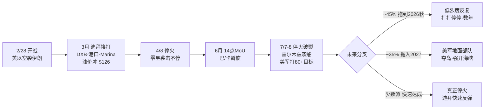
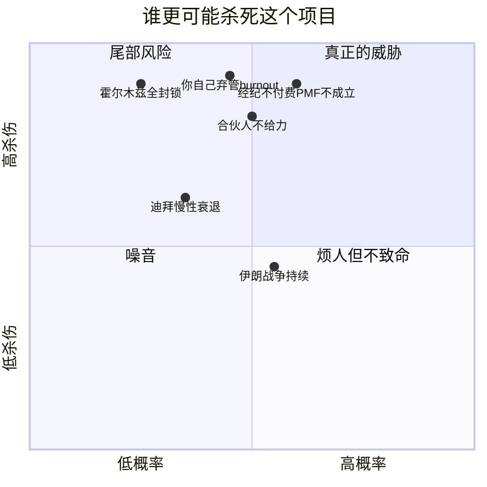
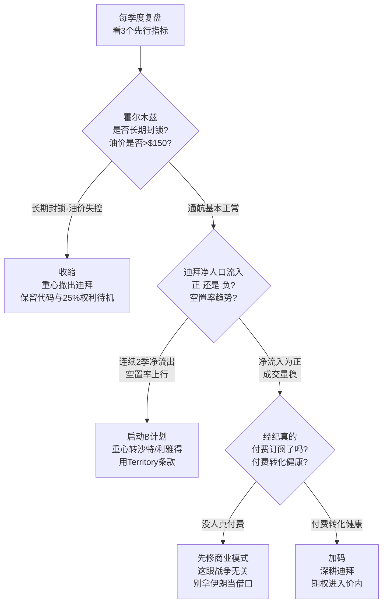

# Pinzos 严厉版战略评估 —— 不讨好、只讲事实

> 2026-07-09 ｜ 应要求:完全客观、甚至 harsh。数据来源见文末。
> 读之前先接受一件事:下面很多话会让你不舒服。不舒服的地方,往往就是你一直没敢正视的地方。

---

## 0. 一句话总判断

**"危险与机会共存"是安慰话,不是分析。** 诚实的说法是:这场战争让迪拜这门生意的**期望值下降、方差上升**——赔率变差、噪音变大。这不叫"机会",叫"更烂的牌配更抖的手"。任何跟你说"危机就是机遇"的人,是在卖你情绪价值。

**但**——把最重的一句放前面——**你真正的风险,根本不是这场战争。** 你在为一件相对可控的事(战争,你下行有界)焦虑,却对真正会杀死这个项目的三件事视而不见。这份文档一半在泼冷水,另一半在告诉你:**你的恐惧点错了地方。**

---

## 1. 战争会打多久?—— 不要问"何时结束",要问"慢性到什么程度"

分析师的主流判断不是"快结束",而是 **"protracted by design"(被刻意拖长)**:

- 特朗普开战时说"4–5 周",现在已 **130+ 天**。
- 概率分布:~25% 认为 2026 年 5 月底前了结、~45% 拖到 2026 秋、**~35% 拖进 2027**。
- **75% 的分析师**认为美国最终会派**地面部队**夺取伊朗领土、强行重开霍尔木兹——那是更深的泥潭。
- 结构性死结:签停火的伊朗政府**管不住革命卫队(IRGC)**,所以任何停火都是"打打停停"。6 月签的 14 点 MoU(巴基斯坦、卡塔尔斡旋)已在 7/7–8 破裂。
- 学术判断:一个国家过度依赖精确空袭,往往**制造升级而非解决**,因为不给对方下台阶。

**结论:别在脑子里给这场战争设"结束日期"。正确的心理模型是——这是一个未来 2–5 年会反复发作的慢性病,不是一场会痊愈的急病。** 你要做 10 年的项目,就得假设前几年始终有这个背景噪音。

---

## 2. 那 10 年项目是不是不现实?—— 这问题问错了

你把两件不同的事混成了一件,所以才会纠结"10 年 vs 赚波块钱"。拆开:

### 2a. 对"迪拜稳定增长"这个论点:严厉地说,它已经受损
如果你当初的心理模型是"迪拜房产 10 年稳稳复利、水涨船高",**这个模型基本死了**。一个坐在慢性地缘断层带上的市场,未来 10 年出现"失去的 2–3 年"的概率被显著抬高。霍尔木兹是悬在头上的刀:全球 25% 海运石油、20% LNG 走这里,真被长期封锁,油价冲 $170–200、全球 GDP 掉近 3 个百分点的尾部情景不是科幻。**指望迪拜给你平滑的 10 年增长曲线,是天真。**

### 2b. 但对"你这个项目"的风险:你把它和"押注迪拜"划了等号,这是错的
- 你收的是 **SaaS 平台费,不是成交额**。市场越冷,经纪越要抢更小的买家池,越需要工具——你的需求逆周期或至少被隔离。
- 你的技术栈在**德国**,不在迪拜。导弹打 DXB 不影响你的服务器。
- 你的合同 Territory = **整个中东**,可转向正在承接迪拜外流的**沙特/利雅得**。
- 你**几乎零现金投入**,下行有界:最坏你输的是机会成本,押牌照/办公室/营销进战区的是 Shell Wang。

**所以"10 年项目"这个框架本身就是错的心智模型。** 正确的框架是:

> **这是一张便宜的、长期的"中东 proptech 看涨期权"。权利金 = 你的时间。**

- 你不该"承诺 10 年"——那会诱导你在结构性高风险的地区**沉没成本式地过度投入个人时间与情感**,这才是你会受的伤。
- 你也不该当"赚波块钱就跑"——你的 25% 永久费和股权上行,只有让期权**跑上好几年**才兑现,今天跑等于把期权当废纸扔了。
- 正确姿势:**用极低成本让它长期活着,让它自己决定是深度价内还是归零。** 中间态,不是二选一。

---

## 3. 最严厉的一段:你的恐惧点错了地方

现在对你本人不留情面。

你花了整整一段对话,打磨一份**合同的字体、对齐、页边距、姓名栏、下划线**——几个小时的抛光。而这门生意能不能成,取决于你**几乎没有压力测试过**的东西:

- Shell Wang 真有他声称的客户关系和渠道吗?还是那只是个 pitch?
- "第一天 6 个付费客户、一年 1000 个"是**真实验证过的数据**,还是招商话术?
- 有没有任何证据表明迪拜经纪**真的会掏 $99/月**订阅?你的 leads 表常年 0 行(见项目记忆),付费意愿是**未经验证的假设**。
- 单人技术 bus factor = **你**。合同 5.1(e) 写死:你一旦弃管 30 天,25% 费率 3 年递减归零。你 burnout、分心、去做下一个项目,比伊朗导弹更可能亲手掐死这条现金流。

**合同很漂亮,生意未经验证。** 你对伊朗战争的焦虑,某种程度上是一种**高级拖延**——盯着新闻里戏剧化的导弹,逃避那个更无聊也更难的问题:**这门生意本身是真的吗?**

看这张图:**真正在"高概率·高杀伤"象限的,是经纪不付费、合伙人不给力、你自己弃管——全是无聊的执行风险,不是战争。** 战争和霍尔木兹杀伤大,但对你**这个**项目的致死概率反而没那么高(因为你下行有界)。你把 90% 的焦虑分配给了错的格子。

---

## 4. 策略:该怎么制订

不给平台空话,给可执行的决策框架。

### 原则
1. **改心智模型**:从"10 年使命"改成"低成本长期期权"。停止情感承诺,开始按指标管理。
2. **先打无聊的风险,再管战争**:未来 90 天,你该做的不是刷伊朗新闻,是**验证付费意愿**(哪怕 10 个经纪真金白银订阅)、**压测 Shell Wang 的交付**(他 180 天注册公司+RERA 牌照的进度就是第一个试金石)、**给自己的技术单点上保险**(文档化、可交接)。
3. **把 Territory 弹性做成"预置的 B 计划",不是"事后的救火"**:现在就想清楚沙特/利雅得怎么进,而不是等迪拜数据崩了才翻合同。
4. **个人不可逆投入最小化**:别搬去迪拜、别 all-in 个人时间、别为它拒掉别的机会。让它是你的期权之一,不是你的全部。

### 决策树:每季度看 3 个先行指标,落到 3 个状态之一

**你要盯的不是新闻里的导弹,是这三个慢变量**:霍尔木兹通航状态、迪拜净人口流入(DLD/RERA 数据、租金空置率——你的 dashboard 本就该能看)、经纪付费转化率。前两个决定"要不要转向/收缩",第三个决定"这生意到底真不真"。

---

## 5. 一句话收尾(不讨好版)

**这不是一个值得你 all-in 10 年的信仰级项目,也不是赚一波就跑的快钱——它是一张你已经用极低权利金买到手的、中东 proptech 的长期看涨期权。** 战争让标的更抖了,但没改变期权的性质:下行有界、基础设施在战区外、收入逆周期。**真正能让这张期权归零的,不是伊朗,是你自己——如果你把它当信仰去过度投入、或者三个月后热情退了把它扔了。** 按指标管它,别按情绪管它。战争是背景噪音,你的执行力才是主旋律。

---

## 来源
- [Could the US-Iran war become a protracted 'frozen' conflict? — Al Jazeera](https://www.aljazeera.com/news/2026/4/30/could-the-us-iran-war-become-a-protracted-frozen-conflict)
- [The US insists it won't be a 'forever war.' Experts beg to differ — CNBC](https://www.cnbc.com/2026/03/05/iran-conflict-duration-middle-east-regional-war-experts.html)
- [The Iran war could drag into 2027, analyst warns — Fortune](https://fortune.com/2026/03/27/iran-war-timeline-fall-2027-us-ground-troops-kharg-island-seizure/)
- [The US-Iran MoU looks at managing the pain rather than ending the war — Al Jazeera](https://www.aljazeera.com/news/2026/6/29/the-us-iran-mou-looks-at-managing-the-pain-rather-than-ending-the-war)
- [2026 Strait of Hormuz crisis — Wikipedia](https://en.wikipedia.org/wiki/2026_Strait_of_Hormuz_crisis)
- [From chokepoint to crisis: the Strait of Hormuz and global oil markets — Brookings](https://www.brookings.edu/articles/from-chokepoint-to-crisis-the-strait-of-hormuz-and-global-oil-markets/)
- [Iran War: How High Could Oil Prices Get with Hormuz Closure — Bloomberg](https://www.bloomberg.com/graphics/2026-iran-war-hormuz-closure-oil-shock/)
- [Property prices are down in Dubai. Blip or serious? — Fortune](https://fortune.com/2026/06/01/property-prices-down-dubai/)
- [Dubai economy & rental market surge June 2026 — Dubai Chronicle](https://www.dubaichronicle.com/2026/07/07/dubai-economy-rental-market-june/)
