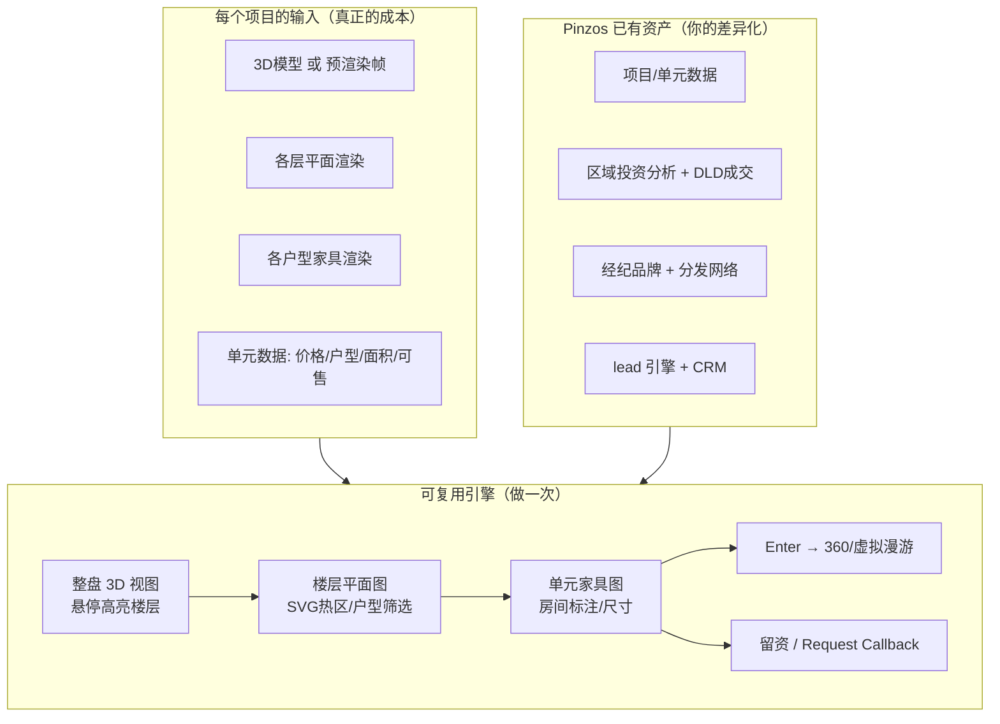
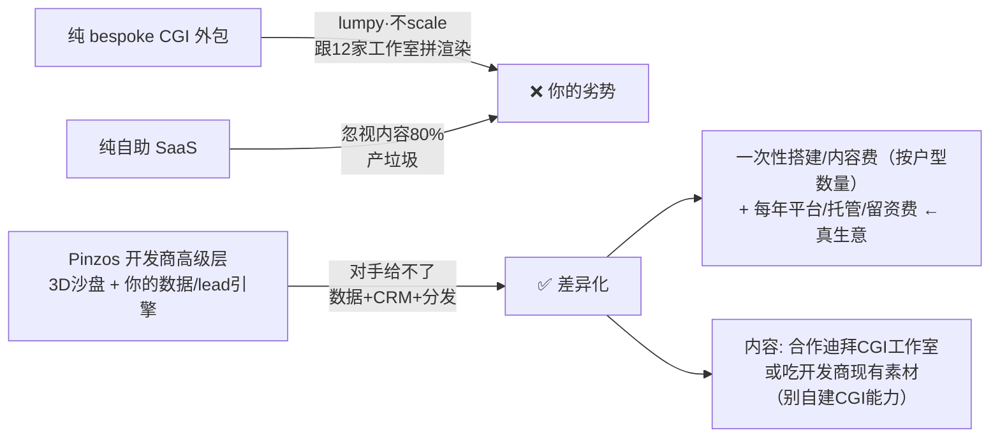

# 开发商 3D 户型沙盘产品 —— 可行性 + 商业模式评估(不裹糖版)

---
## 🅿️ 状态:PARKED(暂缓,未实现)— 2026-07-10 决定
**现在不做。** 核心 Pinzos 尚未证真(2026-07-10 Live 数据:3 个订阅=2 个内部号+1 个真外人 slavynchuk94,全是免费试用,$0 到账)。在证明经纪真会付费之前,建这个 = shiny object。

### 重启门槛(到点再回来验证价值、再决定做不做)
| 门 | 触发条件 | 对应动作 |
|---|---|---|
| **Gate 1 — 先证核心(总闸,不过免谈)** | ≥ **25-30 个真实付费经纪**(排除内部号·真实扣款成功·非试用),且第 2 月留存 > 60-70% | 才算"赢得了扩张的权利";在此之前任何新功能都暂缓 |
| **Gate 2 — 轻量版(路A·给经纪·复用Luna+live tour)** | 过 Gate 1 **且** ≥ 5-8 个付费经纪**主动要**/愿加价买"AI带讲导览",或假门测试有明显意向 | 做精简 MVP:户型图+AI讲解+多人带看,**不做照片级3D** |
| **Gate 3 — 重量版(路B·给开发商·照片级3D)** | **与经纪数量无关**:1 个真实开发商签 LOI 或付 **30% 定金** | 才动工;一个有预算的开发商 > 任何数量的经纪 |

**一句话记住:~30 个留存付费经纪 = 扩张许可证。低于这个数,这个想法待在这份文档里别动。**

**核心洞察(别忘):卖点是"AI讲解+多人实时陪同带看"的 tour,不是3D模型;3D只是舞台,Luna+live tour 才是护城河(CGI工作室做不了)。"用户上传3D模型"是内容陷阱——按他们真有的(户型图/照片/数据)设计。**

---

> 2026-07-10 ｜ 触发:合伙人称开发商想要 Aldar "World of Aldar" 那种交互式 3D 销售沙盘。
> 参考实例:world.aldar.com(整盘 3D → 悬停高亮楼层 → 平面图 → 户型家具图 → 筛选 → 留资)

## 0. 一句话地基
**软件只占价值 20%,80% 在"内容"(照片级 3D 渲染)。** 下面所有判断都从这句推出。

## 1. 可行性:能做,但难点不在软件
- 下钻交互壳(整盘→楼层→平面→单元→筛选→留资)= 成熟 Web 工程,不难。
- 真正的贵和难:**每栋楼/每层平面/每个户型的照片级渲染从哪来?** 开发商只有 Revit/CAD + PDF 户型图 + 几张效果图,**没有网页可用 3D**。

## 2. 市场:红海,不是蓝海
至少十几家在做,数家在迪拜:Intwopixel、PROPVR、Chasing Illusions、Saabsoft、R2U、REALITIQ、IdealTwin。Aldar 那套八成是外包 bespoke。**"我们先做"叙事不成立**,得靠价格/质量/整合赢。

## 3. 架构:引擎做一次,项目 = 配置 + 素材

**绝不逐项目重写代码。但引擎是标配、不是差异化——十几个对手都有。**

## 4. "自助上传编辑"工具 = 诱人但错
只解决 20%(软件),没解决 80%(内容)。开发商产不出 Aldar 级素材、也不会对齐模型/画热区。**自助 = 垃圾进垃圾出 = 退款。** 内容问题既是护城河也是成本,自助恰好甩给最产不出它的人。

## 5. 定价:AED 50-100万($136k-272k)
- 整盘 bespoke(多楼几百户):偏高端但不离谱(R2U 数字孪生 4-14 周,Intwopixel 8 周);但 CGI 成本可能吃掉 40-70% 利润。
- 单栋楼:大概率贵了,对手报更低。
- 红海里你是价格接受者,margin 全看内容管线多便宜。**裸卖模型打不过专业 CGI 工作室。**

## 6. 推荐结构:别当 CGI 外包,当"数据+3D"的开发商版 Pinzos

## 7. 严厉提醒:第三次 shiny object
核心 Pinzos 未证真(经纪没验证会付 $99/月)、Shell 未证明能交付,现在又兴奋于第三件事——红海里、需要你没有的 CGI 能力、资本密集。**战争焦虑→打磨合同→这个,同一个病。**

**但公道地说:这个可能才是真生意**——开发商有预算,卖一个 50 万 > 400 个经纪 $99/月,还复用你已有数据。**纪律只有一条:别投机式先建。让一个开发商签 LOI 或付 30% 定金再动工。** 产不出定金的"想要"都是空气。

## 8. 合同必须现在钉的一件事
你建的东西 = Platform IP 归你(2.1)。若通过迪拜公司卖给开发商作平台/服务收入 → Gross Revenue → **你抽 25%**(这正是 25% 要抓的高价值平台收入,不是 Shell 的中介佣金)。**动工前跟 Shell 确认:开发商 3D 生意走平台收入线,不走他另开的实体**——否则将来一笔烂账。

## 9. 技术要点(若真做）
- 环境/周边:预渲染 3D hero(turntable 帧 或 three.js/R3F 烘焙环境),**不用你的实时 MapLibre 地图**(用户判断正确,要分开)。Aldar 的"周边"是烘焙渲染,不是活地图。
- 楼层高亮:3D 渲染上叠多边形热区。
- 平面图:正交顶视渲染 + 每户 SVG 热区,绑单元数据(**你 Pinzos 已有 UnitTypesTab 单元数据**)。
- 单元:家具平面图 + 房间标注;Enter → 360 全景/Matterport 式漫游。
- 全部数据驱动配置,3D 素材是输入不是代码。

## 下一步(建议顺序)
1. 让合伙人找一个**真实开发商**表达意向 → 要 LOI 或定金(验证需求)。
2. 同步跟 Shell 敲定"开发商收入走平台线、你抽 25%"。
3. 只有 1 成立后,才做 MVP:先用**一个真实项目的现有素材**拼一个 demo(不自建 CGI),验证交付能力。
4. 别在核心 Pinzos(经纪付费)证真前 all-in 这条线。

---

## 补充(2026-07-10):绑 Luna + live tour 的方向 + A/B 分路

**已开始推广,出现第 1 个订阅($49,部分是 test account)。** 纪律:①只看 Stripe Live mode;②排除内部号(internalVisitorIds);③一个真实订阅=信号非 PMF,**先去问这个订阅者为什么付、是否续、会否用**——他的嘴决定下一步,不是想象力。

**核心洞察(用户的好直觉):卖点不是 3D 模型,是"AI 讲解 + 多人实时陪同带看"的 tour。3D 只是舞台,tour 才是价值——而 Luna + live tour 已建好,这正是 CGI 工作室做不了的护城河。**

**坑重申:"用户上传 3D 模型"= 昨天的内容陷阱。** 经纪/开发商没有网页可用 3D,只有户型图/照片/数据。按他们真有的东西设计。

### 两条路(须选,建议先 A 后 B)
- **路 A(轻·给经纪·先做)**:不用照片级 3D。用已有 Luna + live tour,在**户型图+照片+项目数据**上做 AI 讲解 + 多人带看。内容成本≈0,复用现有引擎,直卖给已有付费迹象的经纪群。marginal 开发量小。
- **路 B(重·给开发商·后做)**:照片级 3D 沙盘 + AI tour。内容贵、红海、有预算。**必须 LOI/30% 定金到手才动工。**

### 纪律排序
榨干第 1 个订阅者反馈 → 确认更多经纪愿付 → Luna/live tour 上加轻量 3D tour(路 A) → 开发商 LOI 到手才碰路 B。顺序反 = 第四次 shiny object。
